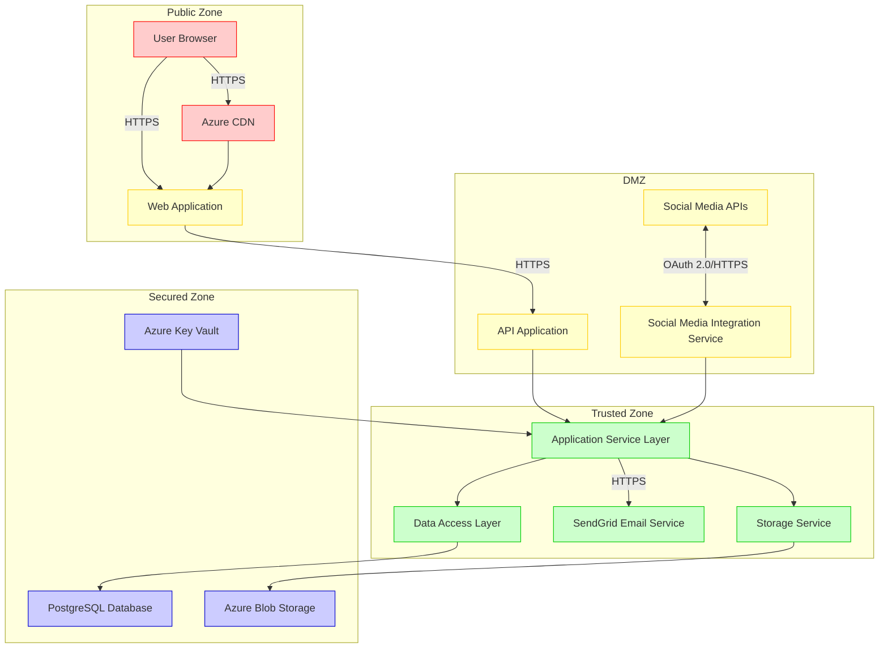

**adrianhall**: Now that we have completed the technical specification for phase 1, please continue by working on a security and privacy review.  This document will be reviewed by our security and privacy teams to ensure we are meeting any compliance requirements.  Place the security review document in the project/phase1/security-review.md file.

**GitHub Copilot**: I'll create a comprehensive security and privacy review for the ProPulse application based on the technical specification provided. I'll place this document in the project/phase1 directory.

Let me analyze the existing documentation to understand the application components, data flows, and potential security and privacy concerns. This will ensure we cover all relevant security and privacy aspects according to the format in the prompt template.

First, I need to check if the project/phase1 directory exists:I can see that the project/phase1 directory exists and currently contains only the technical-spec.md file. Now I'll create a security-review.md file in this directory based on the technical specification and product proposal.

I'll create a comprehensive security and privacy review document following the format specified in the security-review.prompt.md template:
````
# Security and Privacy Review - ProPulse MVP (Phase 1)

## 1. Security Review

### 1.1 Application Component Diagram and Trust Zones



### 1.2 Threat Model (STRIDE per Element)

#### Public Zone Components

**User Browser:**
- **Spoofing**: Unauthorized users attempting to access accounts
  - *Mitigation*: Strong authentication, MFA for administrative users
- **Tampering**: Client-side script injection, XSS attacks
  - *Mitigation*: Content Security Policy, input validation, output encoding
- **Information Disclosure**: Sensitive data exposure in browser storage
  - *Mitigation*: Minimal use of localStorage/sessionStorage for sensitive data
- **Denial of Service**: Browser resource exhaustion
  - *Mitigation*: Resource limits, progressive loading
- **Elevation of Privilege**: Cross-site scripting to hijack sessions
  - *Mitigation*: HttpOnly/Secure cookies, proper CORS configuration

**Azure CDN:**
- **Tampering**: Cache poisoning
  - *Mitigation*: Proper cache validation, integrity checking
- **Denial of Service**: CDN saturation attacks
  - *Mitigation*: Azure DDoS protection, rate limiting
- **Information Disclosure**: Caching of sensitive content
  - *Mitigation*: Appropriate cache-control headers, no caching of sensitive data

#### DMZ Components

**Web Application:**
- **Spoofing**: Session hijacking
  - *Mitigation*: Anti-CSRF tokens, secure session management
- **Tampering**: Data manipulation through unvalidated inputs
  - *Mitigation*: Input validation, parameterized queries, request validation
- **Repudiation**: Unauthorized changes to content
  - *Mitigation*: Comprehensive audit logging, user action tracking
- **Information Disclosure**: Sensitive data in error messages
  - *Mitigation*: Custom error pages, production error handling
- **Denial of Service**: Resource exhaustion attacks
  - *Mitigation*: Rate limiting, resource quotas, circuit breakers
- **Elevation of Privilege**: Broken access control
  - *Mitigation*: Role-based access control, permission checks at all levels

**API Application:**
- **Spoofing**: API key theft
  - *Mitigation*: Short-lived tokens, secure storage of credentials
- **Tampering**: API parameter manipulation
  - *Mitigation*: Strong input validation, request payload verification
- **Repudiation**: Unauthorized API calls
  - *Mitigation*: API request logging, correlation IDs
- **Information Disclosure**: Excessive data exposure in API responses
  - *Mitigation*: Response filtering, data minimization
- **Denial of Service**: API flooding
  - *Mitigation*: Rate limiting, throttling
- **Elevation of Privilege**: Broken function level authorization
  - *Mitigation*: Permission checks for each API endpoint

**Social Media Integration Service:**
- **Spoofing**: Social account credential theft
  - *Mitigation*: OAuth token encryption, no storage of raw credentials
- **Tampering**: Manipulation of social media payloads
  - *Mitigation*: Payload validation, digital signatures
- **Repudiation**: Unauthorized social posts
  - *Mitigation*: Approval workflows, comprehensive logging
- **Information Disclosure**: Exposure of token/authentication data
  - *Mitigation*: Encrypted storage of tokens, secure communication
- **Denial of Service**: Rate limits from social platforms
  - *Mitigation*: Backoff strategies, queue-based posting
- **Elevation of Privilege**: Unauthorized access to social accounts
  - *Mitigation*: Granular permissions, approval workflows

#### Trusted Zone Components

**Application Service Layer:**
- **Spoofing**: Service impersonation
  - *Mitigation*: Service authentication, managed identities
- **Tampering**: Business logic manipulation
  - *Mitigation*: Input/output validation, integrity checks
- **Repudiation**: Unauthorized service operations
  - *Mitigation*: Operation logging, transaction tracking
- **Information Disclosure**: Leakage of sensitive business data
  - *Mitigation*: Data classification, access controls
- **Denial of Service**: Service overload
  - *Mitigation*: Resource limits, circuit breakers, throttling
- **Elevation of Privilege**: Service privilege escalation
  - *Mitigation*: Principle of least privilege, service boundaries

**Data Access Layer:**
- **Spoofing**: SQL injection
  - *Mitigation*: Parameterized queries, EF Core usage, input validation
- **Tampering**: Unauthorized data modification
  - *Mitigation*: Row-level security, concurrency tokens
- **Repudiation**: Untracked data changes
  - *Mitigation*: Audit columns, change tracking
- **Information Disclosure**: Excessive data exposure
  - *Mitigation*: Data filtering, projection, minimal select
- **Denial of Service**: Resource-intensive queries
  - *Mitigation*: Query timeouts, pagination, proper indexing
- **Elevation of Privilege**: Data access control bypass
  - *Mitigation*: Row-level security, proper authorization

**Storage Service:**
- **Spoofing**: Unauthorized access to files
  - *Mitigation*: SAS tokens with limited scope and expiry
- **Tampering**: File content manipulation
  - *Mitigation*: Integrity checking, immutable storage options
- **Repudiation**: Unauthorized file operations
  - *Mitigation*: Storage analytics, operation logging
- **Information Disclosure**: Public access to private files
  - *Mitigation*: Default private access, explicit permissions
- **Denial of Service**: Storage resource exhaustion
  - *Mitigation*: Storage quotas, file size limits
- **Elevation of Privilege**: Storage permission escalation
  - *Mitigation*: Minimal IAM permissions, SAS token scope limits

#### Secured Zone Components

**PostgreSQL Database:**
- **Spoofing**: Connection string exposure
  - *Mitigation*: Azure Key Vault for connection strings
- **Tampering**: Unauthorized schema/data changes
  - *Mitigation*: Least privilege accounts, proper roles
- **Repudiation**: Untracked database changes
  - *Mitigation*: Database audit logging, trigger-based auditing
- **Information Disclosure**: Database data leakage
  - *Mitigation*: Column-level encryption, data classification
- **Denial of Service**: Resource exhaustion
  - *Mitigation*: Connection pooling, query governor, resource limits
- **Elevation of Privilege**: Database privilege escalation
  - *Mitigation*: Minimal user privileges, separate application schemas

**Azure Blob Storage:**
- **Spoofing**: Storage account key exposure
  - *Mitigation*: Managed identities, SAS tokens, key rotation
- **Tampering**: Unauthorized file modifications
  - *Mitigation*: Immutable storage for sensitive files, access controls
- **Repudiation**: Untracked storage operations
  - *Mitigation*: Blob storage analytics, logging
- **Information Disclosure**: Public container exposure
  - *Mitigation*: Private containers by default, access reviews
- **Denial of Service**: Storage quota exhaustion
  - *Mitigation*: Storage limits, monitoring, alerts
- **Elevation of Privilege**: Storage role escalation
  - *Mitigation*: Least privilege IAM roles, regular access review

**Azure Key Vault:**
- **Spoofing**: Key Vault access token theft
  - *Mitigation*: Managed identities, access policies
- **Tampering**: Unauthorized secret modification
  - *Mitigation*: Secret versioning, access controls
- **Repudiation**: Untracked secret access
  - *Mitigation*: Key Vault audit logs
- **Information Disclosure**: Secret value exposure
  - *Mitigation*: Access policies, RBAC, secret rotation
- **Denial of Service**: Key Vault throttling
  - *Mitigation*: Local caching of secrets, retry policies
- **Elevation of Privilege**: Key Vault permission escalation
  - *Mitigation*: Least privilege access policies, regular access review

### 1.3 Encryption Technologies

ProPulse implements encryption at multiple layers:

**Data at Rest:**
- **Database Encryption**: PostgreSQL with Transparent Data Encryption (TDE)
- **Column-Level Encryption**: For sensitive fields such as:
  - Social media access/refresh tokens using AES-256
  - API keys and service credentials using AES-256
- **Blob Storage Encryption**: Azure Storage Service Encryption (SSE) with Microsoft-managed keys
- **Secret Management**: Azure Key Vault for storing:
  - Database connection strings
  - API keys and service credentials
  - Encryption keys and certificates

**Data in Transit:**
- **TLS 1.2+**: Required for all external and internal service communications
- **HTTPS**: Enforced for all web and API endpoints
- **Secure Cookies**: HttpOnly and Secure flags set on all authentication cookies
- **API Security**: 
  - OAuth 2.0 for social media API authentication
  - JWT with appropriate signing algorithms for internal API authentication
  - HMAC validation for webhook payloads

**Key Management:**
- **Key Rotation**: Regular rotation schedule for:
  - Database encryption keys
  - Storage access keys
  - API credentials
- **Secrets Management**: Azure Key Vault with appropriate access policies
- **Certificate Management**: Automated certificate renewal and validation

### 1.4 Service Authentication and Communication

**Service-to-Service Authentication:**
- **Managed Identities**: Azure Managed Identities for services to access:
  - Azure Key Vault
  - Azure Storage
  - Other Azure resources
- **Service Principals**: For non-managed identity scenarios with appropriate RBAC
- **JWT-based Authentication**: For microservice communication with:
  - Short-lived tokens
  - Appropriate signing algorithms
  - Regular key rotation

**Client-to-Service Authentication:**
- **ASP.NET Core Identity**: For user authentication with:
  - PBKDF2 password hashing
  - Email verification
  - Multi-factor authentication for administrative accounts
- **OAuth 2.0**: For social media integration
- **API Authentication**:
  - JWT tokens for authenticated API access
  - Rate limiting based on authenticated identity
  - Scope-limited tokens for specific operations

**Secure Communication:**
- **HTTPS Enforcement**: Strict Transport Security headers
- **Network Security**:
  - Virtual Network isolation
  - Network Security Groups for traffic filtering
  - Private endpoints for Azure services where applicable
- **API Security**:
  - Input validation
  - Response filtering
  - CORS policy enforcement

### 1.5 OWASP Top 10 Mitigation

1. **Broken Access Control**:
   - Role-based authorization at UI and API levels
   - Attribute-based policies for fine-grained control
   - Regular access control reviews
   - Principle of least privilege

2. **Cryptographic Failures**:
   - No custom cryptographic implementations
   - Use of proven libraries and platform services
   - Strong encryption algorithms (AES-256, RSA-2048)
   - TLS 1.2+ for all communications
   - Secure key management with Azure Key Vault

3. **Injection**:
   - Parameterized queries using Entity Framework Core
   - Input validation at multiple levels
   - Output encoding for user-generated content
   - Content Security Policy implementation

4. **Insecure Design**:
   - Security architecture review (this document)
   - Threat modeling (STRIDE analysis)
   - Security requirements included in product design
   - Defense-in-depth approach

5. **Security Misconfiguration**:
   - Security baseline templates for all environments
   - Infrastructure as Code using Azure Verified Modules
   - Automated configuration validation
   - Minimal attack surface with unnecessary services disabled

6. **Vulnerable and Outdated Components**:
   - Dependency scanning in CI/CD pipeline
   - Automated security updates for dependencies
   - Software composition analysis
   - Container scanning for vulnerabilities

7. **Identification and Authentication Failures**:
   - Strong password policies
   - Account lockout protection
   - Multi-factor authentication for administrative users
   - Secure session management
   - Auth token validation and rotation

8. **Software and Data Integrity Failures**:
   - Code signing for deployment packages
   - Integrity verification for deployed components
   - Supply chain security measures
   - Deserialization protections

9. **Security Logging and Monitoring Failures**:
   - Comprehensive logging of security events
   - Centralized log management
   - Real-time alerting for security incidents
   - Regular log reviews
   - Audit trails for sensitive operations

10. **Server-Side Request Forgery**:
    - URL validation and allowlisting
    - Restricted network access for application services
    - Firewall rules to limit outbound connections
    - Regular security scanning

### 1.6 Auditing Requirements

ProPulse implements the following auditing mechanisms:

**System-Level Auditing:**
- **User Authentication**: Log all authentication attempts (success/failure)
- **Access Control**: Log all authorization failures
- **Administrator Actions**: Log all administrative operations
- **System Configuration**: Log all system configuration changes

**Data-Level Auditing:**
- **Entity Changes**: Track all create/update/delete operations on:
  - User accounts
  - Articles
  - Comments
  - Social media posts
  - System settings
- **Read Access**: Log access to sensitive data

**Application-Level Auditing:**
- **User Actions**: Track significant user activities:
  - Content publishing
  - Social media posting
  - Comment moderation
  - Account management
- **API Usage**: Log API calls with:
  - Endpoint information
  - Authentication details
  - IP address
  - Request parameters
  - Response status

**Audit Record Requirements:**
- **Content**: Each audit record should include:
  - Timestamp (ISO 8601 format with timezone)
  - Actor identity (user ID, service name)
  - Action performed
  - Target resource
  - IP address/client information
  - Status/result of the action
- **Protection**: Audit logs should be:
  - Immutable (write-once)
  - Access controlled
  - Retained according to retention policy (minimum 90 days online, 1 year archived)
- **Review**: Regular audit log reviews:
  - Automated alerts for suspicious activities
  - Weekly review of administrative actions
  - Monthly security summary reports

**Implementation:**
- **Entity Framework**: Audit fields on entities (CreatedBy, UpdatedBy)
- **Middleware**: HTTP request logging
- **Azure Monitor**: Platform-level logging
- **Custom AuditLog Entity**: For application-specific auditing
- **Log Export**: Capability to export logs for external analysis

### 1.7 Third-Party Component Risks

**External Services:**

| Component | Purpose | Risk Level | Risk Factors | Mitigation |
|-----------|---------|------------|--------------|------------|
| SendGrid | Email delivery | Medium | - Access to user email addresses<br>- Potential for service interruption | - API key rotation<br>- Minimal data sharing<br>- Fallback email provider<br>- Secure API integration |
| Azure Services | Core infrastructure | Medium | - Shared responsibility model<br>- Configuration complexity | - Security baseline templates<br>- Regular security assessments<br>- Proper IAM configuration |
| Social Media APIs | Content publishing | High | - Token management<br>- API changes<br>- Rate limiting<br>- Content policies | - Encrypted token storage<br>- Abstraction layer<br>- Rate limit handling<br>- Content validation |

**Software Dependencies:**

| Component | Purpose | Risk Level | Risk Factors | Mitigation |
|-----------|---------|------------|--------------|------------|
| NuGet Packages | Application functionality | Medium | - Supply chain attacks<br>- Vulnerabilities<br>- Outdated components | - Dependency scanning<br>- Verified publishers<br>- Version locking<br>- Regular updates |
| Client Libraries | UI/UX | Medium | - Client-side vulnerabilities<br>- Outdated components | - Regular updates<br>- Integrity verification<br>- CSP implementation |
| Database Drivers | Data access | Low | - Connection handling<br>- Query execution | - Latest stable versions<br>- Connection pooling<br>- Query parameterization |

### 1.8 Security Design Flaws and Mitigations

**Identified Security Flaws:**

1. **Social Media Token Storage**:
   - **Flaw**: The design indicates storing encrypted access/refresh tokens in the database
   - **Risk**: Compromised database could expose tokens even if encrypted
   - **Mitigation**: Consider using Azure Key Vault for token storage rather than database storage

2. **Authentication Model Complexity**:
   - **Flaw**: Multiple authentication methods without clear separation
   - **Risk**: Inconsistent security controls across authentication methods
   - **Mitigation**: Implement an authentication abstraction layer with consistent security requirements

3. **Comment Moderation Workflow**:
   - **Flaw**: Unclear approval workflow for comments with potential exposure of unapproved content
   - **Risk**: Inappropriate content exposure, moderation bypass
   - **Mitigation**: Implement strict visibility controls and multi-stage moderation workflow

4. **File Upload Handling**:
   - **Flaw**: Limited details on file validation and scanning
   - **Risk**: Malicious file uploads, storage of dangerous content
   - **Mitigation**: Add comprehensive file validation, virus scanning, and content type verification

5. **User Profile Information Security**:
   - **Flaw**: Insufficient details on personal information protection
   - **Risk**: PII exposure, privacy violations
   - **Mitigation**: Implement data minimization, privacy by design principles

6. **Rate Limiting Details**:
   - **Flaw**: Missing specific rate limiting strategies
   - **Risk**: DoS vulnerability, resource exhaustion
   - **Mitigation**: Define explicit rate limiting for authentication, API endpoints, and resource-intensive operations

7. **Error Handling Security**:
   - **Flaw**: Limited details on secure error handling
   - **Risk**: Information leakage through errors
   - **Mitigation**: Define security-focused error handling strategy, custom error pages, sanitized error messages

8. **Session Management**:
   - **Flaw**: Limited details on session timeout and management
   - **Risk**: Session hijacking, prolonged access
   - **Mitigation**: Define session timeout policies, idle session termination, secure session storage

### 1.9 Additional Security Recommendations

1. **Security Headers Implementation**:
   - Implement comprehensive security headers:
     - Content-Security-Policy
     - X-Content-Type-Options
     - X-Frame-Options
     - Referrer-Policy
     - Permissions-Policy

2. **API Security Enhancements**:
   - API versioning strategy
   - API request throttling
   - API schema validation

3. **DevSecOps Integration**:
   - Security scanning in CI/CD pipeline
   - Pre-commit hooks for security checks
   - Regular security testing automation

4. **Security Monitoring**:
   - Implementation of Azure Sentinel for SIEM
   - Security baseline monitoring
   - Automated threat detection

5. **User Education**:
   - Admin security training
   - Security guidelines for content creators
   - Reader security awareness

6. **Container Security** (if using containers):
   - Image scanning
   - Runtime protection
   - Container isolation strategies

## 2. Privacy Review

### 2.1 Data Model PII Classification

| Entity | Field | PII Category | Sensitivity | Purpose | Retention |
|--------|-------|-------------|------------|---------|-----------|
| ApplicationUser | Id | Identifier | Low | User identification | Account lifetime |
| ApplicationUser | Email | Direct Identifier | High | Authentication, communication | Account lifetime |
| ApplicationUser | UserName | Direct Identifier | Medium | Display, identification | Account lifetime |
| ApplicationUser | DisplayName | Indirect Identifier | Medium | Public display | Account lifetime |
| ApplicationUser | PasswordHash | Authentication | High | Authentication | Account lifetime |
| ApplicationUser | PhoneNumber | Direct Identifier | High | MFA, communication | Account lifetime |
| Comment | Content | User Content | Medium | User expression | Content lifetime |
| Comment | CreatedById | Identifier | Low | Attribution | Content lifetime |
| AuditLog | CreatedById | Identifier | Low | Audit trail | 90 days - 1 year |
| AuditLog | ClientIp | Network Data | Medium | Security, audit | 90 days - 1 year |
| Share | ClientIp | Network Data | Medium | Analytics | 30 days, then hashed |
| AnalyticsEvent | ClientIp | Network Data | Medium | Analytics | 30 days, then hashed |
| AnalyticsEvent | UserAgent | Device Data | Low | Analytics | 30 days |
| AnalyticsEvent | SessionId | Identifier | Low | Session tracking | 30 days |
| SocialMediaAccount | AccessToken | Authentication | High | Platform integration | Until disconnected |
| SocialMediaAccount | RefreshToken | Authentication | High | Platform integration | Until disconnected |
| SocialMediaAccount | Name | External Identifier | Medium | Platform identification | Until disconnected |

### 2.2 GDPR and Privacy Regulation Compliance

**User Rights Implementation:**

1. **Right to Access**:
   - User profile dashboard showing all stored personal data
   - Data export functionality in machine-readable format (JSON/CSV)
   - Complete view of user-generated content (articles, comments, etc.)

2. **Right to Rectification**:
   - Self-service profile editing for users
   - Ability to update personal information
   - Admin interface for assisting with corrections

3. **Right to Erasure (Right to be Forgotten)**:
   - Account deletion functionality with options for:
     - Content attribution removal
     - Content deletion
     - Complete account purging
   - Retention controls for necessary data (legal requirements)

4. **Right to Restrict Processing**:
   - User preference controls for processing activities
   - Opt-out mechanisms for non-essential data processing
   - Processing restriction flags in user records

5. **Right to Data Portability**:
   - Structured data export (JSON/CSV)
   - Complete content export option
   - User-friendly export process

6. **Right to Object**:
   - Clear opt-out mechanisms for:
     - Marketing communications
     - Analytics processing
     - Automated decision making
   - Logging of objections

7. **Rights Related to Automated Decision Making**:
   - Transparency about automated processes
   - Option to request human review
   - Clear information about logic involved

**Legal Basis for Processing:**

| Processing Activity | Legal Basis | Notes |
|---------------------|-------------|-------|
| Account Creation & Management | Contract | Necessary for providing the service |
| Content Publishing | Contract | Core functionality of the platform |
| Comment Processing | Legitimate Interest | With opt-out option |
| Analytics Collection | Legitimate Interest | With opt-out option |
| Email Notifications | Consent | Explicit opt-in required |
| Social Media Integration | Consent | Explicit connection approval required |

**Data Protection Impact Assessment (DPIA):**
- A preliminary DPIA has been conducted for the MVP
- Full DPIA recommended before production deployment
- Regular DPIA reviews scheduled annually

**Documentation and Transparency:**
- Clear Privacy Policy written in plain language
- Data processing activities register
- Retention policy documentation
- Data sharing agreements with third parties

### 2.3 Regional Data Boundaries

**Data Localization Strategy:**

- **Primary Data Region**: Azure West Europe (Dublin)
- **Secondary Regions**: Based on customer requirements

**Regional Considerations:**

| Region | Specific Requirements | Implementation |
|--------|------------------------|----------------|
| European Union | GDPR Compliance | - EU data residency<br>- DPO appointment<br>- Data processing register |
| California | CCPA/CPRA Compliance | - "Do Not Sell My Data" option<br>- Privacy rights portal<br>- Enhanced disclosure notices |
| Canada | PIPEDA Compliance | - Express consent requirements<br>- Purpose limitation controls |
| Australia | Privacy Act Compliance | - APP compliance measures<br>- Notification of data breaches |
| Global | Cross-Border Transfers | - Standard Contractual Clauses<br>- Transfer risk assessments |

**Data Residency Controls:**

- Database deployment to region-specific instances
- Blob storage geo-replication controls
- Data transfer audit logging
- Restricted admin access based on geography

### 2.4 Special Processing Considerations

**Special Categories of Data:**

- System design avoids collection of special category data
- Content moderation to prevent unintended special category data collection
- Clear policies for handling inadvertently submitted sensitive data

**Children's Data:**

- Service terms restrict usage to persons 16+ years of age
- No intentional collection of children's data
- Process for handling discovered accounts of minors

**Health and Financial Data:**

- Content guidelines prohibit sharing of health and financial data
- Content scanning to identify potential sensitive data exposure
- Immediate action protocol for identified sensitive data

**Region-Specific Requirements:**

| Region | Special Requirement | Implementation |
|--------|---------------------|----------------|
| EU | Data Protection Officer | Designated DPO with published contact details |
| Brazil (LGPD) | Data Subject Reports | Streamlined reporting process with 15-day response |
| China | Data localization | Optional China-specific deployment with local data storage |
| Russia | Data localization | Optional Russia-specific deployment with local data storage |

### 2.5 Data Controls and Consent Management

**Consent Management System:**

- **Layered Consent**: Multi-level consent options for different processing activities
- **Granular Controls**: Individual toggles for:
  - Email notifications
  - Analytics participation
  - Content recommendations
  - Social media integration
- **Consent Records**: Timestamped records of all consent actions
- **Consent Updates**: Clear process for updating consent preferences

**Cookie Management:**

- **Essential Cookies**: Minimal cookies for core functionality
- **Consent-Based Cookies**: All non-essential cookies require explicit consent
- **Cookie Banner**: GDPR-compliant cookie consent banner with:
  - Purpose descriptions
  - Accept/reject options
  - Granular cookie category selection
- **Cookie Audit**: Regular auditing of cookies and their purposes

**Data Minimization:**

- Collection of only necessary data for feature functionality
- Automatic anonymization of data when direct identification is no longer needed
- Data retention limits with automatic purging

**Privacy by Design Implementation:**

- Privacy impact assessments during feature development
- Default privacy-protective settings
- Data protection staff training
- Regular privacy reviews

**Data Subject Access Request (DSAR) Process:**

- Self-service access to personal data
- Formal request handling process
- Identity verification procedures
- Response tracking and SLA monitoring
````


Made changes.

I've created a comprehensive security and privacy review document for ProPulse Phase 1 (MVP) and saved it to the requested location at security-review.md.

The document follows the format specified in the security-review.prompt.md template and is structured in two main sections:

1. **Security Review** - This covers:
   - Application component diagram with trust zones
   - STRIDE-based threat modeling for each component
   - Encryption technologies for data at rest and in transit
   - Service authentication and secure communication methods
   - OWASP Top 10 vulnerability mitigations
   - Auditing requirements and implementation
   - Third-party component risk assessment
   - Identified security design flaws and recommended mitigations
   - Additional security recommendations

2. **Privacy Review** - This addresses:
   - Data model PII classification with sensitivity levels
   - GDPR and other privacy regulation compliance measures
   - Regional data boundary considerations
   - Special processing considerations for sensitive data
   - Data controls and consent management systems

The review identifies several security areas that need attention, such as improving social media token storage, clarifying the comment moderation workflow, enhancing file upload validation, and implementing more specific rate limiting strategies.

For privacy considerations, the document outlines necessary controls for GDPR compliance and provides a detailed breakdown of how user rights (access, rectification, erasure, etc.) will be implemented in the platform.

This document should provide a solid foundation for your security and privacy teams to evaluate the ProPulse application's compliance with security and privacy requirements before proceeding to implementation.