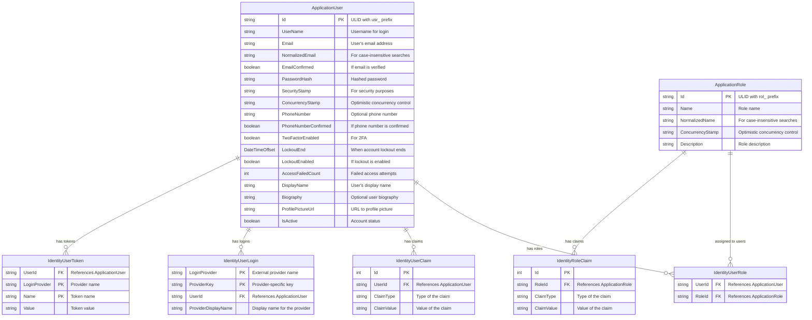
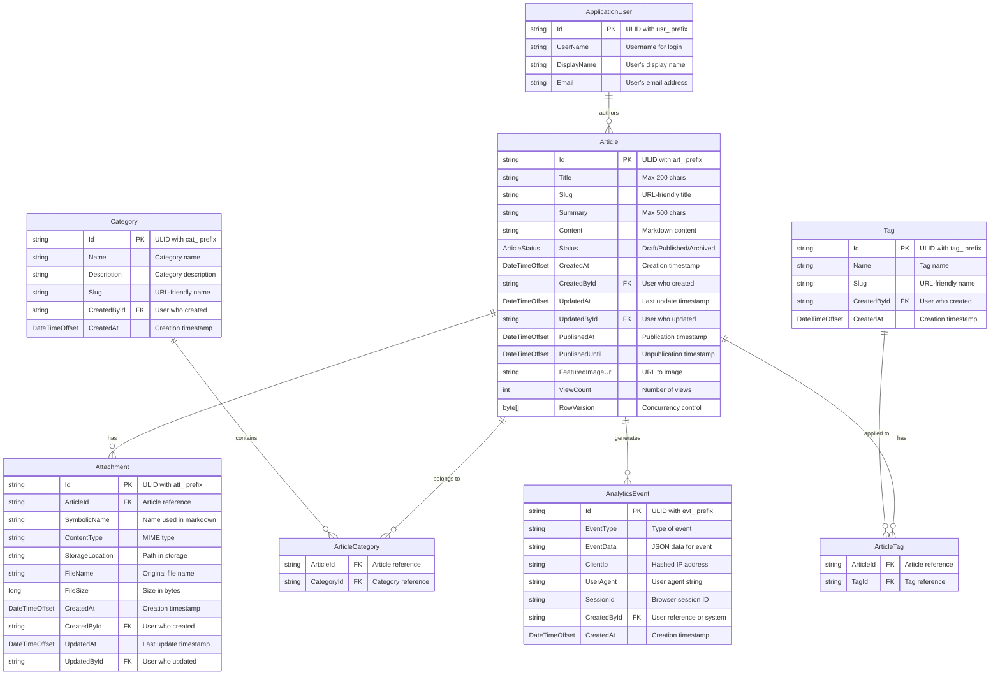
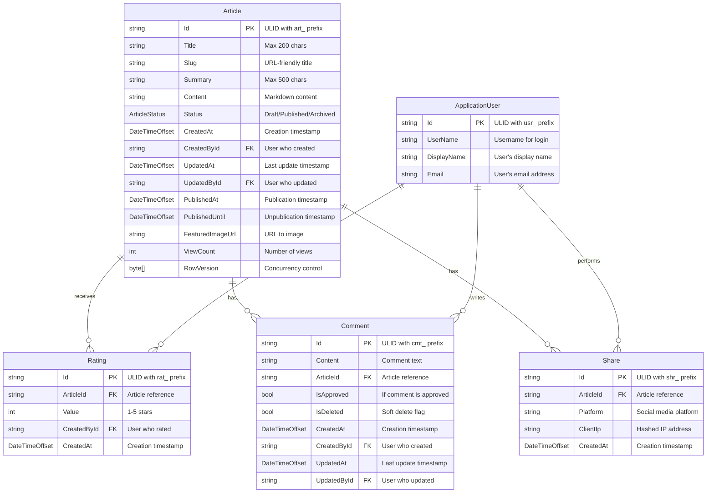
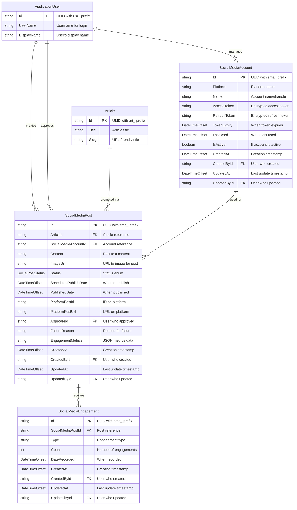
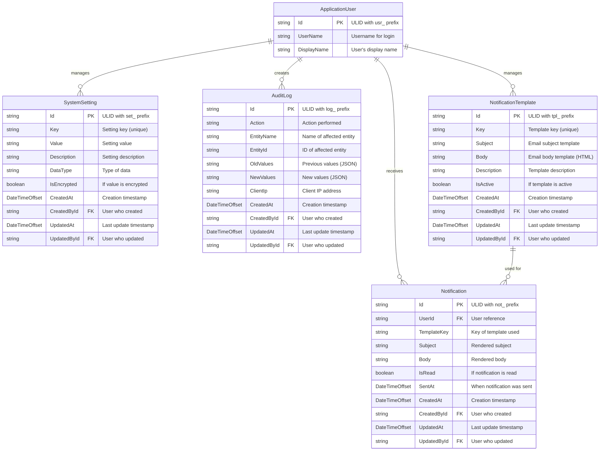

# ProPulse Technical Specification - Phase 1 (MVP)

This technical specification outlines the implementation details for Phase 1 (MVP) of the ProPulse Enterprise Article Publishing & Social Media Marketing Platform.

## Table of Contents

1. [System Architecture](#1-system-architecture)
2. [User Management](#2-user-management)
3. [Content Publishing](#3-content-publishing)
4. [Reader Experience](#4-reader-experience)
5. [Social Media Integration](#5-social-media-integration)
6. [Administration](#6-administration)
7. [Notification System](#7-notification-system)

## 1. System Architecture

### Technical Specification: Overall System Design

#### 1.1 Architectural Approach

For Phase 1 (MVP), we will implement a **modular monolith** architecture. This approach offers several advantages for our initial release:

- **Faster development**: A monolithic architecture allows for quicker initial development with reduced complexity in deployment and testing.
- **Simplified debugging**: Easier to trace issues across system components during the critical early adoption phase.
- **Future scalability**: The modular design enables a potential transition to microservices in later phases as usage scales.
- **Lower operational complexity**: Simpler deployment, monitoring, and maintenance for the MVP phase.

The modular structure divides the application into distinct bounded contexts (User Management, Content Publishing, Social Media Integration, etc.) with well-defined interfaces, allowing for potential extraction into separate services in future phases.

#### 1.2 Technology Stack

| Component | Technology | Justification |
|-----------|------------|---------------|
| Backend Framework | ASP.NET Core 9.0 | Latest stable version with enhanced performance features and C# 12 language support |
| API Architecture | REST with OpenAPI | Industry standard with excellent tooling and client generation capabilities |
| Database | PostgreSQL 17 | Latest version with enhanced JSON performance, improved query planner, and better compatibility with containerized environments |
| Database Extensions | pgvector, citext | Vector storage for AI capabilities (pgvector) and case-insensitive text search (citext) |
| ORM | Entity Framework Core 9.0 | Native integration with ASP.NET Core, LINQ support, and code-first approach |
| Database Migrations | DbUp 5.0 | Script-based migrations with better integration with dotnet Aspire and containerized environments |
| Authentication | ASP.NET Core Identity | Integrated auth with customizable user/role management |
| Frontend | Blazor with Server-Side Rendering | Leverages C# skills, reduces context switching, and provides excellent SEO capabilities |
| UI Component Library | Microsoft Fluent UI for Blazor | Official Microsoft component library with consistent design language, accessibility support, and seamless Blazor integration |
| Cloud Infrastructure | Azure App Service & PostgreSQL | Managed services reducing DevOps complexity for MVP |
| Media Storage | Azure Blob Storage | Scalable, cost-effective solution for storing images and media |
| Caching | Redis Cache | In-memory data store for performance optimization |
| Background Processing | Hangfire | Reliable job scheduling for social media posting and notifications |
| Monitoring | Application Insights | Integrated telemetry for performance monitoring and error tracking |
| CI/CD | GitHub Actions | Automated testing and deployment pipelines |

#### 1.3 System Components and Interactions

The system is divided into the following major components with clear responsibilities:

**Core Application Components:**

1. **Identity and Access Management**
   - User authentication and authorization
   - Role-based permission control
   - Profile management

2. **Content Management System**
   - Article creation and editing
   - Media management
   - Categorization and tagging
   - Publishing workflow

3. **Reader Experience**
   - Article viewing
   - Commenting and rating
   - Sharing functionality
   - User engagement tracking

4. **Social Media Integration**
   - Platform connections
   - Post scheduling and publishing
   - Analytics collection
   - Approval workflows

5. **Administration**
   - User and role management
   - Content moderation
   - System settings
   - Analytics dashboards

**Cross-Cutting Concerns:**

1. **Security Layer**
   - Authentication/authorization enforcement
   - Data protection and encryption
   - CSRF protection
   - Input validation

2. **Data Access Layer**
   - Entity Framework Core context
   - Repository interfaces
   - Query optimization
   - Transaction management

3. **Caching Layer**
   - Content caching
   - User session data
   - Query results caching
   - Distributed cache implementation

4. **Background Processing**
   - Scheduled publication jobs
   - Email notifications
   - Social media posting
   - Analytics aggregation

5. **Logging and Monitoring**
   - Structured logging
   - Performance telemetry
   - Error tracking
   - User activity auditing

#### 1.4 Key User Flows

The MVP will support the following key user flows:

**1. Content Author Flow**
- Sign in as an author
- Create new article draft
- Edit and format content with rich text editor
- Upload and embed images
- Apply categories and tags
- Save draft or publish immediately
- Schedule future publication
- Track article performance metrics

**2. Social Media Manager Flow**
- Sign in as social media manager
- Connect social media accounts
- Create social media posts for articles
- Schedule posts across multiple platforms
- Review and approve pending posts
- Track engagement metrics
- Adjust scheduling strategy based on performance

**3. Reader Flow**
- Browse available articles
- View full article content
- Rate articles
- Comment on articles
- Share articles to social media
- Register for an account
- Manage profile and preferences

**4. Administrator Flow**
- Manage user accounts and permissions
- Review and moderate comments
- Configure system settings
- Access analytics dashboards
- Monitor system performance
- Generate reports

#### 1.5 Development Deployment Architecture

For development and testing purposes, we will use a simplified local development environment that mimics the production architecture while allowing for efficient development workflows:

- **Local Development Environment**:
  - dotnet Aspire for service orchestration, container management, and local development dashboard
  - Aspire-managed PostgreSQL container for local database
  - Aspire-managed Redis container for caching
  - Aspire-managed Azurite container for local Azure storage emulation
  - Hot reload support for rapid iteration with `dotnet watch`

- **Development Workflow**:
  - Feature branch workflow with GitHub
  - PR-based review process
  - Automated CI builds on PR creation
  - Full F5 debugging experience with Aspire dashboard for service monitoring

- **Project Structure**:
  ```
  /
  ├── docs/                 # Documentation
  ├── project/              # Project planning documents
  ├── src/                  # Source code
  │   ├── ProPulse.Core/    # Domain models and core business logic
  │   ├── ProPulse.Data/    # Data access layer and repositories
  │   ├── ProPulse.Database/ # DbUp database migration scripts
  │   ├── ProPulse.Web/     # Blazor web application
  │   ├── ProPulse.Shared/  # Shared utilities and components
  │   ├── ProPulse.Api/     # API endpoints (if needed)
  │   └── ProPulse.AppHost/ # dotnet Aspire orchestration
  └── test/                 # Test projects
      ├── ProPulse.Core.Tests/
      ├── ProPulse.Data.Tests/
      ├── ProPulse.Web.Tests/
      └── ProPulse.Api.Tests/
  ```

- **Local Development Requirements**:
  - .NET 9 SDK with Aspire workload installed
  - Visual Studio 2025 or JetBrains Rider 2025.1+ with Aspire support
  - Node.js 20+ (for frontend tooling)
  - Git

#### 1.6 Production Deployment Architecture

For the MVP phase, we will deploy a simplified architecture:

- **Web Application**: Azure App Service (with at least 2 instances for availability)
- **Database**: Azure Database for PostgreSQL (Flexible Server)
- **Storage**: Azure Blob Storage for media files
- **Cache**: Azure Cache for Redis
- **Background Jobs**: Running within the web application process using Hangfire

The application will be deployed to two environments:

1. **Staging**: For testing and client approval before production release
2. **Production**: The live environment used by end-users

In future phases, we will consider:
- Moving to Azure Kubernetes Service for container orchestration
- Implementing a dedicated API gateway
- Separating components into distinct microservices
- Implementing a more sophisticated CDN strategy
- Adding a dedicated search service

#### 1.7 Database Migration Strategy

For database schema management and migrations, we will use DbUp instead of the traditional Entity Framework Core migrations approach. This choice provides several benefits in an Aspire-based architecture:

- **SQL-based migrations**: Direct control over the database schema with native SQL scripts
- **Versioned scripts**: Each migration is a SQL script with a version number
- **Transaction support**: Migrations run within transactions for atomicity
- **Better container support**: Simpler execution within containerized environments
- **Platform independence**: Scripts can be run against any PostgreSQL instance without requiring the .NET runtime
- **Idempotent migrations**: Support for scripts that can be run multiple times without side effects
- **Reliable journal**: Tracking of executed scripts in a dedicated schema table

The implementation will follow these principles:

##### Migration Script Organization

```
src/ProPulse.Database/
├── Scripts/
│   ├── 0001_CreateIdentitySchema.sql
│   ├── 0002_CreateApplicationSchema.sql
│   ├── 0003_AddArticleTables.sql
│   └── ...
├── Functions/
│   ├── CalculateAverageRating.sql
│   └── ...
├── Procedures/
│   ├── CreateArticle.sql
│   └── ...
└── Program.cs
```

##### Migration Process

1. **Development**: 
   - Developers create numbered SQL scripts for schema changes
   - Scripts are version controlled in the repository
   - Local development uses Aspire to run PostgreSQL and apply migrations
   - The DbUp migration runner is executed as part of application startup

2. **CI/CD Pipeline**:
   - Migration step runs before application deployment
   - Verification step ensures scripts are idempotent
   - Failure rolls back the deployment

3. **Production**:
   - Migrations run as a separate step before application deployment
   - Read-only database user for application, separate admin user for migrations
   - Transaction logging and backup before running migrations

##### Integration with Aspire

The DbUp migration runner will be registered as a service in the Aspire AppHost project:

```csharp
var builder = DistributedApplication.CreateBuilder(args);

var postgres = builder.AddPostgres("database")
    .WithImageTag("postgres:16");

// Register the database migrator as a separate Project resource
var dbMigrator = builder.AddProject<Projects.ProPulse_Database>("database-migrator")
    .WithReference(postgres);

// Ensure migrations complete before the web app starts
var api = builder.AddProject<Projects.ProPulse_Api>("api")
    .WithReference(postgres)
    .WithDependency(dbMigrator);
```

This approach ensures that database migrations run successfully before the application attempts to connect to the database.

#### 1.8 PostgreSQL Extensions and Advanced Features

PostgreSQL 17 provides several powerful extensions that we'll leverage for improved application capabilities:

##### pgvector Extension

The pgvector extension enables vector storage and similarity search functionality, which we'll use for AI-powered features:

| Use Case | Implementation | Benefits |
|----------|---------------|----------|
| Content Similarity | Store article content embeddings for similarity comparison | Enables "related articles" recommendations based on content rather than just tags |
| Semantic Search | Generate and store vector embeddings for search content | More intelligent search results that understand context beyond keyword matching |
| User Preference Modeling | Store user interest vectors based on reading/interaction patterns | Enables personalized content recommendations |
| Image Similarity | Store vector representations of article images | Allows searching for visually similar images across the platform |

Sample database schema for vector storage:

```sql
-- Create the extension
CREATE EXTENSION IF NOT EXISTS vector;

-- Create a table for article embeddings
CREATE TABLE article_embeddings (
    article_id UUID PRIMARY KEY REFERENCES articles(id) ON DELETE CASCADE,
    content_embedding vector(1536),  -- OpenAI embedding dimension
    title_embedding vector(1536),
    created_at TIMESTAMPTZ NOT NULL DEFAULT NOW()
);

-- Create an index for similarity search
CREATE INDEX article_embeddings_idx ON article_embeddings 
USING ivfflat (content_embedding vector_l2_ops) WITH (lists = 100);
```

##### citext Extension

The citext extension provides case-insensitive text comparison, improving data discoverability:

| Use Case | Implementation | Benefits |
|----------|---------------|----------|
| User Search | Store usernames and display names as citext | Case-insensitive user search (e.g., finding "JohnDoe" when searching for "johndoe") |
| Tag Normalization | Store tag names as citext | Prevent duplicate tags that differ only in case (e.g., "Technology" vs. "technology") |
| URL Slug Uniqueness | Use citext for article and category slugs | Ensure URL uniqueness regardless of case |
| Email Addresses | Store email addresses as citext | Case-insensitive email matching for authentication |

Sample database schema for citext usage:

```sql
-- Create the extension
CREATE EXTENSION IF NOT EXISTS citext;

-- Use citext for tag names to ensure case-insensitive uniqueness
CREATE TABLE tags (
    id UUID PRIMARY KEY DEFAULT gen_random_uuid(),
    name CITEXT NOT NULL UNIQUE,
    slug VARCHAR(75) NOT NULL UNIQUE,
    created_at TIMESTAMPTZ NOT NULL DEFAULT NOW()
);

-- Use citext for user email for case-insensitive matching
ALTER TABLE "AspNetUsers" ALTER COLUMN "NormalizedEmail" TYPE CITEXT;
```

Integration with our application:

1. **Entity Framework Configuration**:
   ```csharp
   modelBuilder.HasPostgresExtension("vector");
   modelBuilder.HasPostgresExtension("citext");
   
   modelBuilder.Entity<Tag>()
       .Property(t => t.Name)
       .HasColumnType("citext");
   ```

2. **DbUp Migration Scripts**:
   ```sql
   -- In 0001_InitialSetup.sql
   CREATE EXTENSION IF NOT EXISTS vector;
   CREATE EXTENSION IF NOT EXISTS citext;
   ```

3. **Vector Operations in Repository Layer**:
   ```csharp
   public async Task<IEnumerable<Article>> FindSimilarArticlesAsync(Guid articleId, int limit = 5)
   {
       var embedding = await _context.ArticleEmbeddings
           .Where(e => e.ArticleId == articleId)
           .Select(e => e.ContentEmbedding)
           .FirstOrDefaultAsync();
   
       if (embedding == null)
           return Enumerable.Empty<Article>();
   
       return await _context.ArticleEmbeddings
           .Where(e => e.ArticleId != articleId)
           .OrderBy(e => e.ContentEmbedding.DistanceTo(embedding))
           .Take(limit)
           .Join(_context.Articles,
               e => e.ArticleId,
               a => a.Id,
               (e, a) => a)
           .ToListAsync();
   }
   ```

##### Integration with Aspire

The DbUp migration runner will be registered as a service in the Aspire AppHost project:

```csharp
var builder = DistributedApplication.CreateBuilder(args);

var postgres = builder.AddPostgres("database")
    .WithImageTag("postgres:16");

// Register the database migrator as a separate Project resource
var dbMigrator = builder.AddProject<Projects.ProPulse_Database>("database-migrator")
    .WithReference(postgres);

// Ensure migrations complete before the web app starts
var api = builder.AddProject<Projects.ProPulse_Api>("api")
    .WithReference(postgres)
    .WithDependency(dbMigrator);
```

This approach ensures that database migrations run successfully before the application attempts to connect to the database.

#### 1.9 ID Generation Strategy

For our entity identification needs, we will use string-based IDs rather than traditional numeric or UUID formats. This decision allows us to select an optimal ID format based on our specific requirements. Below is an analysis of different ID generation techniques and our recommended approach.

##### ID Format Comparison

| Format | Description | Advantages | Disadvantages |
|--------|-------------|------------|---------------|
| UUID/GUID | 128-bit identifiers typically represented as 36-character strings (with hyphens) | - Guaranteed uniqueness without coordination<br>- Native support in many languages/databases<br>- No central sequencer needed | - Not sortable by generation time<br>- Relatively large size (16 bytes)<br>- Random distribution can cause B-tree index fragmentation<br>- Not human-friendly |
| ULID | Universally Unique Lexicographically Sortable Identifier | - Time-sortable (first 48 bits are timestamp)<br>- URL-safe (Crockford's Base32)<br>- 26 characters (vs 36 for UUID)<br>- Compatible with UUID in binary form | - Newer format with less widespread support<br>- Possible timestamp privacy concerns<br>- Slightly more complex to generate than UUID |
| Snowflake ID | 64-bit time-based IDs popularized by Twitter | - Very space-efficient (64 bits)<br>- Time-sortable<br>- Includes worker/process ID to avoid collisions | - Requires coordinated generation<br>- Clock drift can cause problems<br>- Less human-readable than string formats |
| NanoID | Collision-resistant string ID generator | - Customizable alphabet and length<br>- URL-friendly<br>- More compact than UUID<br>- Good randomness properties | - Not time-sortable<br>- No inherent timestamp information<br>- Less standardized than UUID |
| KSUID | K-Sortable Unique IDentifier | - Time-sortable<br>- URL-safe<br>- 27 characters | - Less widely adopted<br>- Limited library support<br>- Timestamp with 1-second precision |

##### Selected Approach: ULID

For ProPulse, we will use the **ULID (Universally Unique Lexicographically Sortable Identifier)** format for our IDs. This choice provides an optimal balance of our requirements:

1. **Time-Based Sorting**: ULIDs include a timestamp component, allowing natural chronological sorting—critical for content like articles and comments.

2. **URL Friendliness**: ULIDs use Crockford's Base32 encoding, making them safe for use in URLs without additional encoding.

3. **Space Efficiency**: At 26 characters, ULIDs are more compact than standard UUIDs while maintaining a 128-bit space.

4. **Database Performance**: The monotonic nature of ULIDs results in better B-tree index performance than random UUIDs.

5. **Decentralized Generation**: ULIDs can be generated without coordination across services, supporting our future microservices evolution.

6. **Human Readability**: While not perfect, ULIDs are more human-readable than UUIDs, especially when debugging.

##### Implementation: IdGenerator Service

We will implement a centralized `IdGenerator` service that will be used throughout the application for generating IDs:

```csharp
namespace ProPulse.Core.Services;

/// <summary>
/// Provides methods for generating unique identifiers for application entities.
/// </summary>
public interface IIdGenerator
{
    /// <summary>
    /// Generates a new unique ID string.
    /// </summary>
    /// <returns>A ULID-formatted string identifier.</returns>
    string NewId();
    
    /// <summary>
    /// Generates a new unique ID string with a custom prefix.
    /// </summary>
    /// <param name="prefix">The prefix to prepend to the ID (e.g., "usr" for users).</param>
    /// <returns>A prefixed ULID-formatted string identifier.</returns>
    string NewId(string prefix);
}

/// <summary>
/// Implementation of the ID generator service using the ULID format.
/// </summary>
public class UlidGenerator : IIdGenerator
{
    /// <summary>
    /// Generates a new unique ID string using the ULID format.
    /// </summary>
    /// <returns>A ULID-formatted string identifier.</returns>
    public string NewId()
    {
        return Ulid.NewUlid().ToString();
    }
    
    /// <summary>
    /// Generates a new unique ID string with a custom prefix.
    /// </summary>
    /// <param name="prefix">The prefix to prepend to the ID (e.g., "usr" for users).</param>
    /// <returns>A prefixed ULID-formatted string identifier.</returns>
    public string NewId(string prefix)
    {
        return $"{prefix}_{Ulid.NewUlid()}";
    }
}
```

This service will be registered in the dependency injection container and used throughout the application:

```csharp
// Registration in services
services.AddSingleton<IIdGenerator, UlidGenerator>();

// Usage example
public class ArticleService
{
    private readonly IIdGenerator _idGenerator;
    
    public ArticleService(IIdGenerator idGenerator)
    {
        _idGenerator = idGenerator;
    }
    
    public async Task<Article> CreateArticleAsync(ArticleCreationDto dto)
    {
        var article = new Article
        {
            Id = _idGenerator.NewId("art"),
            Title = dto.Title,
            // Other properties...
            CreatedAt = DateTimeOffset.UtcNow
        };
        
        // Save article...
        
        return article;
    }
}
```

Additionally, we may use entity-specific prefixes to improve debugging and readability:

| Entity Type | Prefix | Example ID |
|-------------|--------|------------|
| User | usr | usr_01HGFZQ64VPKN7DXHKXDW0ENS4 |
| Article | art | art_01HGFZQN7C7MXG4SR89449VMEH |
| Comment | cmt | cmt_01HGFZR58F8KDHYFFV8CS8K21P |
| Category | cat | cat_01HGFZRHAEYE6K4K61AKTM6H1K |
| Social Media Account | sma | sma_01HGFZRVNKHEV10JEQ2YD3QSZK |

This approach balances the benefits of both human-readability and system efficiency while maintaining the sortability advantage of ULIDs.

#### 1.10 Base Entity Model

To promote code reuse and ensure consistent tracking of entity metadata, we will implement a `BaseEntity` abstract class that all core domain entities will inherit from. This approach provides several benefits:

1. **Consistent Auditing**: Unified tracking of creation and modification timestamps and users
2. **Optimistic Concurrency**: Built-in support for preventing concurrent update conflicts
3. **Standardized IDs**: Consistent ID generation and formatting across all entities
4. **Reduced Boilerplate**: Eliminates duplicate property definitions across entities

##### BaseEntity Class Design

```csharp
namespace ProPulse.Core.Entities;

/// <summary>
/// Base class for all core domain entities providing common functionality.
/// </summary>
public abstract class BaseEntity
{
    /// <summary>
    /// Gets or sets the unique identifier for the entity.
    /// </summary>
    public string Id { get; set; } = null!;
    
    /// <summary>
    /// Gets or sets the date and time when the entity was created.
    /// </summary>
    public DateTimeOffset CreatedAt { get; set; }
    
    /// <summary>
    /// Gets or sets the ID of the user who created the entity.
    /// </summary>
    public string CreatedById { get; set; } = null!;
    
    /// <summary>
    /// Gets or sets the date and time when the entity was last updated.
    /// </summary>
    public DateTimeOffset UpdatedAt { get; set; }
    
    /// <summary>
    /// Gets or sets the ID of the user who last updated the entity.
    /// </summary>
    public string UpdatedById { get; set; } = null!;
    
    /// <summary>
    /// Gets or sets the row version for optimistic concurrency control.
    /// </summary>
    public byte[] RowVersion { get; set; } = null!;
}
```

##### Database Implementation

We will use database triggers to automatically maintain the tracking fields. Here's an example trigger for the `articles` table:

```sql
CREATE OR REPLACE FUNCTION update_entity_tracking_fields()
RETURNS TRIGGER AS $$
BEGIN
    -- Set created_at and created_by for new records
    IF TG_OP = 'INSERT' THEN
        NEW.created_at = NOW();
        NEW.updated_at = NOW();
        -- created_by_id and updated_by_id are expected to be set by the application
        -- If they are not, we use a default system user ID
        IF NEW.created_by_id IS NULL THEN
            NEW.created_by_id = 'sys_00000000000000000000000000';
        END IF;
        IF NEW.updated_by_id IS NULL THEN
            NEW.updated_by_id = NEW.created_by_id;
        END IF;
    END IF;
    
    -- Update the updated_at timestamp for any update operation
    IF TG_OP = 'UPDATE' THEN
        NEW.created_at = OLD.created_at;
        NEW.created_by_id = OLD.created_by_id;
        NEW.updated_at = NOW();
        -- updated_by_id is expected to be set by the application
        -- If it is not, we keep the old value
        IF NEW.updated_by_id IS NULL THEN
            NEW.updated_by_id = OLD.updated_by_id;
        END IF;
    END IF;
    
    RETURN NEW;
END;
$$ LANGUAGE plpgsql;

-- Apply the trigger to the articles table
CREATE TRIGGER trg_articles_tracking
BEFORE INSERT OR UPDATE ON articles
FOR EACH ROW EXECUTE FUNCTION update_entity_tracking_fields();
```

#### 1.11 Performance and Scalability Considerations

For the MVP, we will implement these strategies to ensure adequate performance:

- Database indexing for common query patterns
- Caching of frequently accessed content
- Optimized image storage and delivery
- Pagination of large result sets
- Lazy loading of non-critical components
- Async processing for background operations
- Query optimization through careful use of EF Core

The system is designed to handle:
- Up to 100 concurrent active users
- Up to 1,000 published articles
- Up to 10,000 registered users
- Up to 100 social media posts per day

#### 1.12 Security Considerations

The MVP implementation will include these security measures:

- Authentication using ASP.NET Core Identity with secure password policies
- Authorization with role-based and claim-based permissions
- HTTPS for all traffic with appropriate TLS configuration
- CSRF protection on all forms
- Input validation and output encoding to prevent XSS
- SQL injection protection via parameterized queries through EF Core
- Secure storage of credentials and tokens (encrypted)
- Regular security patching and dependency updates
- Audit logging of sensitive operations
- Rate limiting to prevent abuse

## 2. User Management

### Technical Specification: User Authentication and Management

#### 2.1 Data Model

We will leverage ASP.NET Core Identity for user authentication and role management, extending only the user and role classes to use string-based IDs with our ULID format and add custom properties. Other Identity classes will be used directly without extension.



##### Entity Relationships

- **ApplicationUser to IdentityUserRole**: One-to-many relationship. A user can have multiple role assignments.
- **ApplicationRole to IdentityUserRole**: One-to-many relationship. A role can be assigned to multiple users.
- **ApplicationUser to IdentityUserClaim**: One-to-many relationship. A user can have multiple claims.
- **ApplicationRole to IdentityRoleClaim**: One-to-many relationship. A role can have multiple associated claims.
- **ApplicationUser to IdentityUserLogin**: One-to-many relationship. A user can have multiple external login providers.
- **ApplicationUser to IdentityUserToken**: One-to-many relationship. A user can have multiple security tokens.

##### ApplicationUser (extends IdentityUser<string>)

**Base IdentityUser properties**:

| Property Name | .NET Type | DB Type | Description |
|---------------|-----------|---------|-------------|
| Id | string | varchar(32) | Unique identifier for the user using ULID format with "usr_" prefix |
| UserName | string | varchar(256) | Username for login, typically email address |
| Email | string | varchar(256) | User's email address |
| NormalizedEmail | string | varchar(256) | Normalized email for case-insensitive searches |
| EmailConfirmed | bool | boolean | Flag indicating if email has been verified |
| PasswordHash | string | text | Hashed password |
| SecurityStamp | string | text | Timestamp for security purposes |
| ConcurrencyStamp | string | text | For optimistic concurrency control |
| PhoneNumber | string | varchar(50) | Optional phone number |
| PhoneNumberConfirmed | bool | boolean | Flag indicating if phone number is confirmed |
| TwoFactorEnabled | bool | boolean | Flag for two-factor authentication |
| LockoutEnd | DateTimeOffset? | timestamptz | When account lockout ends |
| LockoutEnabled | bool | boolean | If account lockout is enabled |
| AccessFailedCount | int | integer | Number of failed access attempts |

**Custom extensions**:

| Property Name | .NET Type | DB Type | Description |
|---------------|-----------|---------|-------------|
| DisplayName | string | varchar(100) | User's display name |
| Biography | string | text | Optional user biography |
| ProfilePictureUrl | string | varchar(2048) | URL to profile picture |
| IsActive | bool | boolean | Whether the user account is active |

##### ApplicationRole (extends IdentityRole<string>)

**Base IdentityRole properties**:

| Property Name | .NET Type | DB Type | Description |
|---------------|-----------|---------|-------------|
| Id | string | varchar(32) | Unique identifier for role using ULID format with "rol_" prefix |
| Name | string | varchar(256) | Name of the role (Author, SocialMediaManager, Admin, Reader) |
| NormalizedName | string | varchar(256) | Normalized name for case-insensitive searches |
| ConcurrencyStamp | string | text | For optimistic concurrency control |

**Custom extensions**:

| Property Name | .NET Type | DB Type | Description |
|---------------|-----------|---------|-------------|
| Description | string | text | Description of the role |

##### Identity-related tables (standard ASP.NET Core Identity)

We will use the default ASP.NET Core Identity implementation for the following classes, configuring them to use string IDs:

- **IdentityUserRole<string>**: Maps users to roles
- **IdentityUserClaim<string>**: Stores user claims
- **IdentityRoleClaim<string>**: Stores role claims
- **IdentityUserLogin<string>**: Manages external login providers
- **IdentityUserToken<string>**: Stores user tokens

These classes will be used directly without custom extensions, as they provide all necessary functionality for our authentication and authorization needs.

##### Implementation Example

```csharp
using Microsoft.AspNetCore.Identity;
using Microsoft.AspNetCore.Identity.EntityFrameworkCore;
using Microsoft.EntityFrameworkCore;

namespace ProPulse.Data;

/// <summary>
/// Application database context for identity and user management.
/// </summary>
public class ApplicationDbContext : IdentityDbContext<
    ApplicationUser,               // TUser
    ApplicationRole,               // TRole
    string,                        // TKey
    IdentityUserClaim<string>,     // TUserClaim
    IdentityUserRole<string>,      // TUserRole
    IdentityUserLogin<string>,     // TUserLogin
    IdentityRoleClaim<string>,     // TRoleClaim
    IdentityUserToken<string>>     // TUserToken
{
    /// <summary>
    /// Initializes a new instance of the ApplicationDbContext class.
    /// </summary>
    /// <param name="options">The database context options.</param>
    public ApplicationDbContext(DbContextOptions<ApplicationDbContext> options)
        : base(options)
    {
    }

    /// <summary>
    /// Configures the database model.
    /// </summary>
    /// <param name="builder">The model builder.</param>
    protected override void OnModelCreating(ModelBuilder builder)
    {
        base.OnModelCreating(builder);

        // Configure ULID string key length for all identity tables
        builder.Entity<ApplicationUser>().Property(u => u.Id).HasMaxLength(32);
        builder.Entity<ApplicationRole>().Property(r => r.Id).HasMaxLength(32);
        builder.Entity<IdentityUserRole<string>>().Property(ur => ur.UserId).HasMaxLength(32);
        builder.Entity<IdentityUserRole<string>>().Property(ur => ur.RoleId).HasMaxLength(32);
        builder.Entity<IdentityUserClaim<string>>().Property(uc => uc.UserId).HasMaxLength(32);
        builder.Entity<IdentityRoleClaim<string>>().Property(rc => rc.RoleId).HasMaxLength(32);
        builder.Entity<IdentityUserLogin<string>>().Property(ul => ul.UserId).HasMaxLength(32);
        builder.Entity<IdentityUserToken<string>>().Property(ut => ut.UserId).HasMaxLength(32);
        
        // Apply citext extension to email fields for case-insensitive queries
        builder.HasPostgresExtension("citext");
        builder.Entity<ApplicationUser>().Property(u => u.NormalizedEmail).HasColumnType("citext");
        builder.Entity<ApplicationUser>().Property(u => u.NormalizedUserName).HasColumnType("citext");
        builder.Entity<ApplicationRole>().Property(r => r.NormalizedName).HasColumnType("citext");
    }
}
```

#### 2.2 User Experience

##### Registration Page
- **Purpose**: Allow readers to register for an account
- **UI Components**:
  - Email input field
  - Password input field (with strength indicator)
  - Confirm password field
  - Display name input field
  - Registration button
  - Link to login page
- **Implementation**:
  - Client-side validation for all fields
  - Server-side validation through ASP.NET Core Identity
  - Email uniqueness check
  - Password strength enforcement
  - CSRF protection
  - Throttling to prevent abuse

##### Login Page
- **Purpose**: Authenticate existing users
- **UI Components**:
  - Email/username input field
  - Password input field
  - "Remember me" checkbox
  - Login button
  - "Forgot password" link
  - Link to registration page
- **Implementation**:
  - Uses ASP.NET Core Identity for authentication
  - Implements account lockout after failed attempts
  - Captures login metrics for analytics
  - Sets authentication cookies with proper security settings

##### Email Verification Page
- **Purpose**: Verify user's email address
- **UI Components**:
  - Success/failure message
  - Resend verification email button
  - Return to home link
- **Implementation**:
  - Token-based verification through ASP.NET Core Identity
  - Time-limited tokens (24 hours)
  - Updates user status in database upon successful verification

##### Password Reset Flow
- **Purpose**: Allow users to reset forgotten passwords
- **UI Components**:
  - Email input for reset request
  - Reset link sent via email
  - New password and confirmation fields
  - Submit button
- **Implementation**:
  - Token-based password reset through ASP.NET Core Identity
  - Time-limited tokens (1 hour)
  - Email delivery confirmation
  - Password strength validation

##### User Profile Page
- **Purpose**: Allow users to manage their profile information
- **UI Components**:
  - Display name input
  - Biography textarea
  - Profile picture upload/select
  - Email change field (requires verification)
  - Password change section
  - Save changes button
- **Implementation**:
  - Secure form submission with CSRF protection
  - Profile picture storage in Azure Blob Storage
  - Client and server validation
  - Optimistic concurrency control

#### 2.3 Error Handling

- **Registration Errors**:
  - Email already exists
  - Password doesn't meet complexity requirements
  - Validation failures for any fields
  - Service unavailable errors

- **Login Errors**:
  - Invalid credentials
  - Account locked
  - Unverified email (with prompt to verify)
  - Service unavailable errors

- **Email Verification Errors**:
  - Invalid or expired token
  - Already verified email
  - Service unavailable errors

- **Password Reset Errors**:
  - Invalid or expired token
  - Password doesn't meet requirements
  - Service unavailable errors

- **Profile Update Errors**:
  - Validation failures
  - Concurrency conflicts
  - Storage service unavailable (for profile pictures)

#### 2.4 Testing Strategy

##### Acceptance Tests
1. User Registration
   - Register with valid data → Account created, verification email sent
   - Register with existing email → Error message shown
   - Register with weak password → Error message shown
   - Register with mismatched passwords → Error message shown

2. User Login
   - Login with valid credentials → Successfully authenticated
   - Login with invalid credentials → Error message shown
   - Login with unverified email → Prompt to verify email
   - Multiple failed logins → Account lockout after threshold

3. Email Verification
   - Click valid verification link → Account verified
   - Click expired verification link → Error with option to resend
   - Click already used verification link → Message that account is already verified

4. Password Reset
   - Request reset with valid email → Reset email sent
   - Request reset with invalid email → Generic success message (for security)
   - Use valid reset token → Password changed successfully
   - Use expired reset token → Error with option to request new token

5. Profile Management
   - Update profile with valid data → Profile updated successfully
   - Upload valid profile picture → Picture uploaded and displayed
   - Change email → Verification email sent to new address
   - Change password → Password updated, requires re-login

##### Unit Tests
1. User Service
   - CreateUserAsync validates input properly
   - Email verification token generation and validation
   - Password reset token generation and validation
   - User role assignment functions correctly

2. Authentication Logic
   - Login process handles various account states correctly
   - Failed login attempts tracking
   - Account lockout enforcement
   - Security stamp validation

3. Password Management
   - Password hashing is secure
   - Password validation rules enforced consistently
   - Password history tracking (if implemented)

4. Profile Management
   - Profile update logic handles concurrency
   - Profile picture processing and storage
   - Display name normalization and validation

## 3. Content Publishing

### Technical Specification: Article Creation and Management

#### 3.1 Data Model



##### Entity Relationships

- **Article to ApplicationUser**: Many-to-one relationship. Multiple articles can be authored by a single user.
- **Article to Attachment**: One-to-many relationship. An article can have multiple attachments (images, documents, etc.).
- **Article to Category**: Many-to-many relationship via ArticleCategory junction table. An article can belong to multiple categories, and a category can contain multiple articles.
- **Article to Tag**: Many-to-many relationship via ArticleTag junction table. An article can have multiple tags, and a tag can be applied to multiple articles.
- **Article to AnalyticsEvent**: One-to-many relationship. An article can generate multiple analytics events.
- **BaseEntity tracking relationships**: All content entities track their creation and modification users through CreatedById and UpdatedById fields.

##### Article (inherits from BaseEntity)

| Property Name | .NET Type | DB Type | Description |
|---------------|-----------|---------|-------------|
| Title | string | varchar(200) | Article title (max 200 chars) |
| Slug | string | varchar(250) | URL-friendly version of title |
| Summary | string | varchar(500) | Short summary (max 500 chars) |
| Content | string | text | Full article content in Markdown |
| Status | ArticleStatus | article_status | Draft, Published, or Archived status using PostgreSQL enum type |
| PublishedAt | DateTimeOffset? | timestamptz | When the article was published |
| PublishedUntil | DateTimeOffset? | timestamptz | When the article should be unpublished (optional) |
| FeaturedImageUrl | string | varchar(2048) | URL to featured image |
| ViewCount | int | integer | Number of views |

##### ArticleStatus Enum

```csharp
namespace ProPulse.Core.Entities;

/// <summary>
/// Represents the publication status of an article.
/// </summary>
public enum ArticleStatus
{
    /// <summary>
    /// Article is still being worked on and not visible to readers.
    /// </summary>
    Draft,
    
    /// <summary>
    /// Article is published and visible to readers.
    /// </summary>
    Published,
    
    /// <summary>
    /// Article has been archived and is no longer actively displayed.
    /// </summary>
    Archived
}
```

##### PostgreSQL Enum Type Definition

The following SQL creates the enum type for article status:

```sql
-- Create enum type for article status
CREATE TYPE article_status AS ENUM ('Draft', 'Published', 'Archived');

-- Create the articles table using the enum type
CREATE TABLE articles (
    id varchar(32) PRIMARY KEY,
    title varchar(200) NOT NULL,
    slug varchar(250) NOT NULL UNIQUE,
    summary varchar(500),
    content text NOT NULL,
    status article_status NOT NULL DEFAULT 'Draft',
    published_at timestamptz,
    published_until timestamptz,
    featured_image_url varchar(2048),
    view_count integer NOT NULL DEFAULT 0,
    created_at timestamptz NOT NULL,
    created_by_id varchar(32) NOT NULL,
    updated_at timestamptz NOT NULL,
    updated_by_id varchar(32) NOT NULL,
    row_version bytea NOT NULL,
    CONSTRAINT fk_article_created_by FOREIGN KEY (created_by_id) REFERENCES "AspNetUsers" (id),
    CONSTRAINT fk_article_updated_by FOREIGN KEY (updated_by_id) REFERENCES "AspNetUsers" (id)
);
```

##### Entity Framework Core Configuration

```csharp
namespace ProPulse.Data.Configurations;

/// <summary>
/// Entity Framework Core configuration for the Article entity.
/// </summary>
public class ArticleConfiguration : IEntityTypeConfiguration<Article>
{
    /// <summary>
    /// Configures the entity mappings for the Article type.
    /// </summary>
    /// <param name="builder">The entity type builder.</param>
    public void Configure(EntityTypeBuilder<Article> builder)
    {
        // Configure the table name
        builder.ToTable("articles");
        
        // Configure primary key
        builder.HasKey(a => a.Id);
        
        // Configure properties
        builder.Property(a => a.Title).HasMaxLength(200).IsRequired();
        builder.Property(a => a.Slug).HasMaxLength(250).IsRequired();
        builder.Property(a => a.Summary).HasMaxLength(500);
        builder.Property(a => a.Content).IsRequired();
        
        // Configure the enum as a PostgreSQL enum type
        builder.Property(a => a.Status)
            .HasColumnType("article_status")
            .HasConversion<string>()
            .IsRequired();
        
        // Configure indexes
        builder.HasIndex(a => a.Slug).IsUnique();
        builder.HasIndex(a => a.Status);
        builder.HasIndex(a => a.PublishedAt);
    }
}
```

##### Database Trigger for Article Status Transitions

The following database trigger will automatically maintain the `published_at` field when an article's status changes to Published:

```sql
CREATE OR REPLACE FUNCTION manage_article_publication_dates()
RETURNS TRIGGER AS $$
BEGIN
    -- When status changes to Published
    IF (TG_OP = 'INSERT' OR OLD.status <> NEW.status) AND NEW.status = 'Published' THEN
        -- Set published_at to now if not already set
        IF NEW.published_at IS NULL THEN
            NEW.published_at = NOW();
        END IF;
    END IF;
    
    -- When status changes from Published to another status (e.g., Archived)
    IF TG_OP = 'UPDATE' AND OLD.status = 'Published' AND NEW.status <> 'Published' THEN
        -- Set published_until to now if not already set
        IF NEW.published_until IS NULL THEN
            NEW.published_until = NOW();
        END IF;
    END IF;
    
    RETURN NEW;
END;
$$ LANGUAGE plpgsql;

CREATE TRIGGER trg_article_publication_dates
BEFORE INSERT OR UPDATE ON articles
FOR EACH ROW EXECUTE FUNCTION manage_article_publication_dates();
```

##### Attachment (inherits from BaseEntity)

| Property Name | .NET Type | DB Type | Description |
|---------------|-----------|---------|-------------|
| ArticleId | string | varchar(32) | Foreign key to Article |
| SymbolicName | string | varchar(100) | Name used in Markdown |
| ContentType | string | varchar(100) | MIME type |
| StorageLocation | string | varchar(2048) | Path in storage |
| FileName | string | varchar(255) | Original file name |
| FileSize | long | bigint | Size in bytes |

```csharp
namespace ProPulse.Core.Entities;

/// <summary>
/// Represents an attachment associated with an article.
/// </summary>
public class Attachment : BaseEntity
{
    /// <summary>
    /// Gets or sets the ID of the article this attachment belongs to.
    /// </summary>
    public string ArticleId { get; set; } = null!;
    
    /// <summary>
    /// Gets or sets the symbolic name used in Markdown content.
    /// </summary>
    public string SymbolicName { get; set; } = null!;
    
    /// <summary>
    /// Gets or sets the MIME type of the attachment.
    /// </summary>
    public string ContentType { get; set; } = null!;
    
    /// <summary>
    /// Gets or sets the storage location path of the attachment.
    /// </summary>
    public string StorageLocation { get; set; } = null!;
    
    /// <summary>
    /// Gets or sets the original file name of the attachment.
    /// </summary>
    public string FileName { get; set; } = null!;
    
    /// <summary>
    /// Gets or sets the size of the attachment in bytes.
    /// </summary>
    public long FileSize { get; set; }
}
```

##### ArticleCategory

| Property Name | .NET Type | DB Type | Description |
|---------------|-----------|---------|-------------|
| ArticleId | string | varchar(32) | Foreign key to Article (part of composite key) |
| CategoryId | string | varchar(32) | Foreign key to Category (part of composite key) |

##### Category (inherits from BaseEntity)

| Property Name | .NET Type | DB Type | Description |
|---------------|-----------|---------|-------------|
| Name | string | varchar(100) | Category name |
| Description | string | text | Category description |
| Slug | string | varchar(150) | URL-friendly version of name |

##### ArticleTag

| Property Name | .NET Type | DB Type | Description |
|---------------|-----------|---------|-------------|
| ArticleId | string | varchar(32) | Foreign key to Article (part of composite key) |
| TagId | string | varchar(32) | Foreign key to Tag (part of composite key) |

##### Tag (inherits from BaseEntity)

| Property Name | .NET Type | DB Type | Description |
|---------------|-----------|---------|-------------|
| Name | string | varchar(50) | Tag name |
| Slug | string | varchar(75) | URL-friendly version of name |

##### AnalyticsEvent (inherits from BaseEntity)

| Property Name | .NET Type | DB Type | Description |
|---------------|-----------|---------|-------------|
| EventType | string | varchar(100) | Type of event |
| EventData | string | jsonb | JSON data for the event |
| ClientIp | string | varchar(100) | Hashed IP address |
| UserAgent | string | varchar(500) | User agent string |
| SessionId | string | varchar(100) | Browser session ID |

```csharp
namespace ProPulse.Core.Entities;

/// <summary>
/// Represents an analytics event in the system.
/// </summary>
public class AnalyticsEvent : BaseEntity
{
    /// <summary>
    /// Gets or sets the type of the event.
    /// </summary>
    public string EventType { get; set; } = null!;
    
    /// <summary>
    /// Gets or sets the JSON data associated with the event.
    /// </summary>
    public string EventData { get; set; } = null!;
    
    /// <summary>
    /// Gets or sets the hashed IP address of the client.
    /// </summary>
    public string ClientIp { get; set; } = null!;
    
    /// <summary>
    /// Gets or sets the user agent string of the client.
    /// </summary>
    public string UserAgent { get; set; } = null!;
    
    /// <summary>
    /// Gets or sets the browser session ID.
    /// </summary>
    public string SessionId { get; set; } = null!;
    
    // Note: The user associated with this event is tracked via CreatedById
    // If the event is from an anonymous user, CreatedById will be set to a system value "sys_000000000000"
}
```

#### 3.2 User Experience

##### Article Editor
- **Purpose**: Create and edit articles
- **UI Components**:
  - Title input field
  - Summary textarea
  - Rich text editor (supporting formatting, links, images)
  - Category selection dropdown/multi-select
  - Tag input (with autocomplete)
  - Featured image uploader
  - Save draft button
  - Publish button
  - Schedule publication datetime picker
  - Preview button
- **Implementation**:
  - Rich text editor using open-source library
  - Autosave functionality
  - Draft versioning
  - Image upload to Azure Blob Storage
  - Client and server validation
  - Slug generation from title

##### Article Dashboard
- **Purpose**: Manage author's articles
- **UI Components**:
  - List of articles with status
  - Search and filter options
  - Sort by date, status, views
  - Quick action buttons (edit, preview, publish)
  - Basic metrics for each article
  - Pagination
- **Implementation**:
  - Server-side pagination and filtering
  - Caching for performance
  - Real-time status updates
  - Sort by relevance, date, popularity

##### Article Preview
- **Purpose**: Preview how an article will look when published
- **UI Components**:
  - Full article rendering
  - Metadata display
  - Switch between desktop/mobile views
  - Return to editor button
- **Implementation**:
  - Uses same rendering engine as public view
  - Not indexed by search engines
  - Session-based access control

#### 3.3 Error Handling

- **Article Creation/Editing Errors**:
  - Title or content validation failure
  - Image upload failures (size, format)
  - Autosave failures
  - Concurrent edit conflicts
  - Service unavailable errors

- **Publishing Errors**:
  - Missing required fields
  - Invalid publication date
  - Authorization errors
  - Service unavailable errors

- **Category/Tag Management Errors**:
  - Duplicate category/tag names
  - Invalid characters in names
  - Service unavailable errors

#### 3.4 Testing Strategy

##### Acceptance Tests
1. Article Creation
   - Create new article with valid data → Article saved as draft
   - Add categories and tags → Successfully associated
   - Upload featured image → Image stored and displayed
   - Save draft → Draft saved successfully

2. Article Publishing
   - Publish article immediately → Status changes to Published
   - Schedule article for future → Status remains Draft until scheduled time
   - Edit published article → Changes tracked in history
   - Unpublish article → Status changes to Draft

3. Article Management
   - Filter articles by status → Correct articles displayed
   - Search articles by title/content → Relevant articles displayed
   - Sort articles by various criteria → Correct order displayed

##### Unit Tests
1. Article Service
   - Article validation logic
   - Slug generation and uniqueness
   - Draft and publish state transitions
   - Scheduled publishing logic

2. Category/Tag Service
   - Category validation and normalization
   - Tag creation and association
   - Duplicate handling

3. Content Processing
   - HTML sanitization for security
   - Image processing and optimization
   - Draft versioning logic

## 4. Reader Experience

### Technical Specification: Article Reading and Interaction

#### 4.1 Data Model



##### Entity Relationships

- **Notification to ApplicationUser**: Many-to-one relationship. Multiple notifications can be directed to a single user (RecipientId).
- **Notification to NotificationType**: Many-to-one relationship. Many notifications can be of the same notification type.
- **Notification to RelatedEntityType and RelatedEntityId**: Polymorphic relationship. A notification can reference different entity types (projects, tasks, content items, etc.) through these fields.
- **NotificationPreference to ApplicationUser**: Many-to-one relationship. A user can have multiple notification preferences for different notification types.
- **NotificationPreference to NotificationType**: Many-to-one relationship. Multiple users can have preferences for the same notification type.
- **BaseEntity tracking relationships**: All notification entities track their creation and modification users through CreatedById and UpdatedById fields.

##### Rating

| Property Name | .NET Type | DB Type | Description |
|---------------|-----------|---------|-------------|
| Id | string | varchar(32) | Unique identifier using ULID format with "rat_" prefix |
| ArticleId | string | varchar(32) | Foreign key to Article |
| Value | int | smallint | Rating value (1-5) |
| CreatedById | string | varchar(32) | Foreign key to User who created the rating |
| CreatedAt | DateTimeOffset | timestamptz | When the rating was created |

```csharp
namespace ProPulse.Core.Entities;

/// <summary>
/// Represents a rating given to an article by a user.
/// </summary>
public class Rating : BaseEntity
{
    /// <summary>
    /// Gets or sets the ID of the article being rated.
    /// </summary>
    public string ArticleId { get; set; } = null!;
    
    /// <summary>
    /// Gets or sets the rating value (1-5).
    /// </summary>
    public int Value { get; set; }
    
    /// <summary>
    /// Gets or sets the Article this rating is associated with.
    /// </summary>
    public virtual Article? Article { get; set; }
    
    /// <summary>
    /// Gets or sets the User who created this rating.
    /// </summary>
    public virtual ApplicationUser? CreatedBy { get; set; }
}
```

##### PostgreSQL Trigger for Rating Creation

```sql
CREATE OR REPLACE FUNCTION manage_rating_timestamps()
RETURNS TRIGGER AS $$
BEGIN
    -- Set updated_at for any operation
    NEW.updated_at = NOW();
    
    RETURN NEW;
END;
$$ LANGUAGE plpgsql;

CREATE TRIGGER trg_rating_timestamps
BEFORE INSERT OR UPDATE ON ratings
FOR EACH ROW EXECUTE FUNCTION manage_rating_timestamps();
```

##### Comment (inherits from BaseEntity)

| Property Name | .NET Type | DB Type | Description |
|---------------|-----------|---------|-------------|
| Content | string | text | Comment text |
| ArticleId | string | varchar(32) | Foreign key to Article |
| IsApproved | bool | boolean | If comment is approved |
| IsDeleted | bool | boolean | Soft delete flag |

```csharp
namespace ProPulse.Core.Entities;

/// <summary>
/// Represents a user comment on an article.
/// </summary>
public class Comment : BaseEntity
{
    /// <summary>
    /// Gets or sets the comment text content.
    /// </summary>
    public string Content { get; set; } = null!;
    
    /// <summary>
    /// Gets or sets the ID of the article this comment belongs to.
    /// </summary>
    public string ArticleId { get; set; } = null!;
    
    /// <summary>
    /// Gets or sets a value indicating whether the comment is approved and visible to readers.
    /// </summary>
    public bool IsApproved { get; set; }
    
    /// <summary>
    /// Gets or sets a value indicating whether the comment has been soft-deleted.
    /// </summary>
    public bool IsDeleted { get; set; }
}
```

##### Share (inherits from BaseEntity)

| Property Name | .NET Type | DB Type | Description |
|---------------|-----------|---------|-------------|
| ArticleId | string | varchar(32) | Foreign key to Article |
| Platform | string | varchar(50) | Social media platform |
| ClientIp | string | varchar(100) | Hashed IP address for analytics |

```csharp
namespace ProPulse.Core.Entities;

/// <summary>
/// Represents a share of an article to a social media platform.
/// </summary>
public class Share : BaseEntity
{
    /// <summary>
    /// Gets or sets the ID of the article that was shared.
    /// </summary>
    public string ArticleId { get; set; } = null!;
    
    /// <summary>
    /// Gets or sets the name of the social media platform where the article was shared.
    /// </summary>
    public string Platform { get; set; } = null!;
    
    /// <summary>
    /// Gets or sets the hashed IP address of the client for analytics purposes.
    /// </summary>
    public string ClientIp { get; set; } = null!;
}
```

#### 4.2 User Experience

##### Article View Page
- **Purpose**: Display published articles to readers
- **UI Components**:
  - Article title and metadata (author, date, categories)
  - Featured image display
  - Article content with proper formatting
  - Star rating widget
  - Comment section
  - Share buttons for social platforms
  - Related articles
- **Implementation**:
  - Responsive design for all device sizes
  - Lazy loading of images
  - View count tracking
  - SEO optimizations
  - Accessibility compliance

##### Comment Section
- **Purpose**: Allow readers to comment on articles
- **UI Components**:
  - Comment entry textarea (for authenticated users)
  - List of existing comments
  - Login/register prompt for unauthenticated users
  - Report inappropriate comment button
  - Sort comments by newest/oldest
- **Implementation**:
  - Authentication check before allowing comments
  - Real-time comment posting
  - Moderation workflow for new comments
  - Pagination for comments

##### Rating Widget
- **Purpose**: Allow readers to rate articles
- **UI Components**:
  - 5-star rating selector
  - Current average rating display
  - Number of ratings indicator
  - Login/register prompt for unauthenticated users
- **Implementation**:
  - One rating per user enforcement
  - Real-time average update
  - Animation for rating selection
  - Rating analytics tracking

##### Share Functionality
- **Purpose**: Allow readers to share articles on social media
- **UI Components**:
  - Share buttons for BlueSky, LinkedIn, Facebook
  - Share count indicators
  - Copy link button
- **Implementation**:
  - Platform-specific sharing implementations
  - Share count tracking
  - Open Graph metadata for rich previews

#### 4.3 Error Handling

- **Article Loading Errors**:
  - Article not found
  - Access denied (for restricted content)
  - Content loading failures
  - Service unavailable errors

- **Comment Errors**:
  - Authentication required
  - Content validation failures
  - Rate limiting for comment submission
  - Moderation flagging
  - Service unavailable errors

- **Rating Errors**:
  - Authentication required
  - Already rated error
  - Invalid rating value
  - Service unavailable errors

- **Sharing Errors**:
  - Social platform API errors
  - Link generation failures
  - Service unavailable errors

#### 4.4 Testing Strategy

##### Acceptance Tests
1. Article Viewing
   - Load published article → Article displays correctly
   - Test responsive layout → Article displays correctly on different devices
   - View article with all content types → All content renders properly
   - Navigate between articles → Navigation works correctly

2. Commenting
   - Submit valid comment as authenticated user → Comment appears in list
   - Attempt to comment as unauthenticated user → Prompted to login
   - Report inappropriate comment → Comment flagged for moderation
   - Edit own comment → Comment updated successfully

3. Rating
   - Submit rating as authenticated user → Rating recorded, average updated
   - Attempt to rate as unauthenticated user → Prompted to login
   - Change existing rating → Rating updated, average recalculated
   - View ratings as author → Rating metrics visible

4. Sharing
   - Share to each supported platform → Article shared successfully
   - Copy link to clipboard → Link copied successfully
   - View share counts → Accurate share metrics displayed

##### Unit Tests
1. Article Rendering Service
   - HTML sanitization and rendering
   - Metadata formatting
   - View count tracking logic

2. Comment Service
   - Comment validation and sanitization
   - Comment moderation workflow
   - Comment retrieval with pagination

3. Rating Service
   - Rating validation logic
   - Average calculation accuracy
   - One-rating-per-user enforcement

4. Share Service
   - Platform-specific share URL generation
   - Share count tracking
   - Analytics integration

## 5. Social Media Integration

### Technical Specification: Social Media Platform Integration

#### 5.1 Data Model



##### Entity Relationships

- **SocialMediaAccount to ApplicationUser**: Many-to-one relationship. Multiple social media accounts can be managed by a single user.
- **SocialMediaPost to Article**: Many-to-one relationship. Multiple social media posts can promote a single article.
- **SocialMediaPost to SocialMediaAccount**: Many-to-one relationship. Multiple social media posts can be created using the same social media account.
- **SocialMediaPost to ApplicationUser**: Many-to-one relationship. Multiple social media posts can be created or approved by a single user.
- **SocialMediaPost to SocialMediaEngagement**: One-to-many relationship. A social media post can receive multiple engagement metrics.
- **BaseEntity tracking relationships**: All social media entities track their creation and modification users through CreatedById and UpdatedById fields.

##### SocialMediaAccount (inherits from BaseEntity)

| Property Name | .NET Type | DB Type | Description |
|---------------|-----------|---------|-------------|
| Platform | string | varchar(50) | Platform name (BlueSky, LinkedIn, Facebook) |
| Name | string | varchar(100) | Account name/handle |
| AccessToken | string | text | Encrypted access token |
| RefreshToken | string | text | Encrypted refresh token |
| TokenExpiry | DateTimeOffset? | timestamptz | When token expires |
| LastUsed | DateTimeOffset | timestamptz | When last used |
| IsActive | bool | boolean | If account is active |

```csharp
namespace ProPulse.Core.Entities;

/// <summary>
/// Represents a social media account connected to the system.
/// </summary>
public class SocialMediaAccount : BaseEntity
{
    /// <summary>
    /// Gets or sets the social media platform name.
    /// </summary>
    public string Platform { get; set; } = null!;
    
    /// <summary>
    /// Gets or sets the account name or handle on the platform.
    /// </summary>
    public string Name { get; set; } = null!;
    
    /// <summary>
    /// Gets or sets the encrypted access token for the platform API.
    /// </summary>
    public string AccessToken { get; set; } = null!;
    
    /// <summary>
    /// Gets or sets the encrypted refresh token for the platform API.
    /// </summary>
    public string RefreshToken { get; set; } = null!;
    
    /// <summary>
    /// Gets or sets the expiration date and time of the access token.
    /// </summary>
    public DateTimeOffset? TokenExpiry { get; set; }
    
    /// <summary>
    /// Gets or sets the date and time when this account was last used.
    /// </summary>
    public DateTimeOffset LastUsed { get; set; }
    
    /// <summary>
    /// Gets or sets a value indicating whether this account is active.
    /// </summary>
    public bool IsActive { get; set; }
    
    // Note: The user who manages this account is tracked via CreatedById from BaseEntity
}
```

##### SocialMediaPost (inherits from BaseEntity)

| Property Name | .NET Type | DB Type | Description |
|---------------|-----------|---------|-------------|
| ArticleId | string | varchar(32) | Foreign key to Article |
| SocialMediaAccountId | string | varchar(32) | Foreign key to SocialMediaAccount |
| Content | string | text | Post text content |
| ImageUrl | string | varchar(2048) | URL to image for post |
| Status | SocialPostStatus | social_post_status | Draft, Scheduled, Published, or Failed status using PostgreSQL enum type |
| ScheduledPublishDate | DateTimeOffset? | timestamptz | When to publish |
| PublishedDate | DateTimeOffset? | timestamptz | When actually published |
| PlatformPostId | string | varchar(100) | ID of post on platform |
| PlatformPostUrl | string | varchar(2048) | URL to post on platform |
| ApproverId | string? | varchar(32) | User who approved the post |
| FailureReason | string | text | Reason for failure if status is Failed |
| EngagementMetrics | string | jsonb | JSON string of platform metrics |

##### SocialPostStatus Enum

```csharp
namespace ProPulse.Core.Entities;

/// <summary>
/// Represents the status of a social media post.
/// </summary>
public enum SocialPostStatus
{
    /// <summary>
    /// Post is created but not yet scheduled or published.
    /// </summary>
    Draft,
    
    /// <summary>
    /// Post is scheduled for future publication.
    /// </summary>
    Scheduled,
    
    /// <summary>
    /// Post has been published to the social media platform.
    /// </summary>
    Published,
    
    /// <summary>
    /// Post publication failed.
    /// </summary>
    Failed
}
```

##### PostgreSQL Enum Type for SocialPostStatus

```sql
-- Create enum type for social media post status
CREATE TYPE social_post_status AS ENUM ('Draft', 'Scheduled', 'Published', 'Failed');
```

##### SocialMediaEngagement (inherits from BaseEntity)

| Property Name | .NET Type | DB Type | Description |
|---------------|-----------|---------|-------------|
| SocialMediaPostId | string | varchar(32) | Foreign key to SocialMediaPost |
| Type | string | varchar(50) | Engagement type (Like, Share, Comment, etc.) |
| Count | int | integer | Number of engagements |
| DateRecorded | DateTimeOffset | timestamptz | When this engagement data was recorded |

```csharp
namespace ProPulse.Core.Entities;

/// <summary>
/// Represents engagement metrics for a social media post.
/// </summary>
public class SocialMediaEngagement : BaseEntity
{
    /// <summary>
    /// Gets or sets the ID of the social media post.
    /// </summary>
    public string SocialMediaPostId { get; set; } = null!;
    
    /// <summary>
    /// Gets or sets the type of engagement (e.g., Like, Share, Comment).
    /// </summary>
    public string Type { get; set; } = null!;
    
    /// <summary>
    /// Gets or sets the count of engagements of this type.
    /// </summary>
    public int Count { get; set; }
    
    /// <summary>
    /// Gets or sets the date and time when this engagement data was recorded.
    /// </summary>
    public DateTimeOffset DateRecorded { get; set; }
    
    /// <summary>
    /// Gets or sets the social media post this engagement is associated with.
    /// </summary>
    public virtual SocialMediaPost? SocialMediaPost { get; set; }
}
```

#### 5.2 User Experience

##### Social Media Account Connection
- **Purpose**: Connect and manage social media accounts
- **UI Components**:
  - List of connected accounts
  - Add account button
  - OAuth authentication flow
  - Account status indicator
  - Disconnect account button
  - Usage metrics for each account
- **Implementation**:
  - OAuth 2.0 flow for platform authentication
  - Secure token storage with encryption
  - Token refresh mechanism
  - Connection status monitoring

##### Social Media Post Creator
- **Purpose**: Create and schedule posts for articles
- **UI Components**:
  - Article selection (for existing articles)
  - Platform selection (multiple allowed)
  - Post content editor with character count
  - Image selection/upload
  - Preview of how post will look
  - Schedule date/time picker
  - Submit for approval or publish directly (based on permissions)
- **Implementation**:
  - Platform-specific content validation
  - Image optimization for each platform
  - Scheduled publishing through background jobs
  - Draft saving
  - Platform-specific preview rendering

##### Post Approval Dashboard
- **Purpose**: Review and approve pending social media posts
- **UI Components**:
  - List of pending posts
  - Filter by platform, creator, date
  - Post preview
  - Approve/reject buttons
  - Edit capability
  - Comments for feedback
- **Implementation**:
  - Notification system for new pending posts
  - Role-based access control
  - Audit trail of approvals/rejections
  - Bulk action support

##### Social Media Analytics Dashboard
- **Purpose**: View performance metrics for social posts
- **UI Components**:
  - Summary metrics cards
  - Time-series charts for engagement
  - Post performance comparison
  - Platform-specific metrics
  - Export data button
- **Implementation**:
  - Scheduled metrics collection from platform APIs
  - Data aggregation and processing
  - Caching of metrics data
  - Customizable date ranges
  - PDF/CSV export

#### 5.3 Error Handling

- **Account Connection Errors**:
  - OAuth authentication failures
  - Invalid/expired credentials
  - API rate limiting
  - Platform API changes
  - Permission revocation

- **Post Creation/Scheduling Errors**:
  - Content validation failures
  - Image processing errors
  - Scheduling conflicts
  - Platform-specific content restrictions

- **Post Publishing Errors**:
  - Network/connectivity issues
  - API errors from platforms
  - Rate limiting by platforms
  - Authentication token expiration
  - Content policy violations

- **Analytics Collection Errors**:
  - API limitations
  - Missing permissions
  - Data inconsistencies
  - Service unavailability

#### 5.4 Testing Strategy

##### Acceptance Tests
1. Account Connection
   - Connect account with valid credentials → Account connected successfully
   - Attempt to connect with invalid credentials → Appropriate error message
   - Refresh expired tokens → Token refreshed automatically
   - Disconnect account → Account removed from system

2. Post Creation and Scheduling
   - Create post for single platform → Post created successfully
   - Create post for multiple platforms → Post created for each platform
   - Schedule post for future → Post appears in scheduled queue
   - Edit scheduled post → Changes saved correctly

3. Post Approval Workflow
   - Submit post for approval → Appears in approval queue
   - Approve post → Post scheduled or published as configured
   - Reject post with feedback → Post returned to creator with comments
   - Edit post during approval → Changes saved correctly

4. Post Publishing
   - Publish post immediately → Post appears on platform
   - Scheduled post publishes at correct time → Post appears on platform at scheduled time
   - Handle publishing error → Appropriate error message and retry option

5. Analytics Collection
   - View metrics for published post → Accurate data displayed
   - Compare metrics across posts → Comparison data displayed correctly
   - Export analytics data → Data exported in correct format
   - Filter analytics by date range → Correct data shown for selected range

##### Unit Tests
1. Social Media Account Service
   - Token encryption/decryption works correctly
   - Token refresh logic functions correctly
   - Platform-specific API clients handle errors appropriately
   - Account status detection is accurate

2. Post Scheduling Service
   - Post validation logic works for each platform
   - Scheduling conflicts are detected and handled
   - Background job creation and execution
   - Failure handling and notification

3. Analytics Collection Service
   - Metrics collection from each platform API
   - Data aggregation and processing
   - Historical data storage and retrieval
   - Error handling during collection

4. Platform-Specific Clients
   - Authentication flow handling
   - API request/response processing
   - Rate limit handling
   - Error response handling

## 6. Administration

### Technical Specification: Platform Administration

#### 6.1 Data Model

The Administration module includes four main entities for platform management: SystemSetting, AuditLog, NotificationTemplate, and Notification.



##### Entity Relationships

- **Notification to ApplicationUser**: Many-to-one relationship. Multiple notifications can be directed to a single user (RecipientId).
- **Notification to NotificationType**: Many-to-one relationship. Many notifications can be of the same notification type.
- **Notification to RelatedEntityType and RelatedEntityId**: Polymorphic relationship. A notification can reference different entity types (projects, tasks, content items, etc.) through these fields.
- **NotificationPreference to ApplicationUser**: Many-to-one relationship. A user can have multiple notification preferences for different notification types.
- **NotificationPreference to NotificationType**: Many-to-one relationship. Multiple users can have preferences for the same notification type.
- **BaseEntity tracking relationships**: All notification entities track their creation and modification users through CreatedById and UpdatedById fields.

##### SystemSetting (inherits from BaseEntity)

| Property Name | .NET Type | DB Type | Description |
|---------------|-----------|---------|-------------|
| Key | string | varchar(100) | Setting key (unique) |
| Value | string | text | Setting value |
| Description | string | text | Setting description |
| DataType | string | varchar(50) | Type of data (string, int, boolean, json) |
| IsEncrypted | bool | boolean | Whether value is stored encrypted |

```csharp
namespace ProPulse.Core.Entities;

/// <summary>
/// Represents a system configuration setting.
/// </summary>
public class SystemSetting : BaseEntity
{
    /// <summary>
    /// Gets or sets the unique key for this setting.
    /// </summary>
    public string Key { get; set; } = null!;
    
    /// <summary>
    /// Gets or sets the value of this setting (may be encrypted).
    /// </summary>
    public string Value { get; set; } = null!;
    
    /// <summary>
    /// Gets or sets the description of this setting.
    /// </summary>
    public string Description { get; set; } = null!;
    
    /// <summary>
    /// Gets or sets the data type of this setting (string, int, boolean, json).
    /// </summary>
    public string DataType { get; set; } = null!;
    
    /// <summary>
    /// Gets or sets a value indicating whether the value is stored encrypted.
    /// </summary>
    public bool IsEncrypted { get; set; }
}
```

##### AuditLog (inherits from BaseEntity)

| Property Name | .NET Type | DB Type | Description |
|---------------|-----------|---------|-------------|
| Action | string | varchar(100) | Action performed |
| EntityName | string | varchar(100) | Name of affected entity |
| EntityId | string | varchar(32) | ID of affected entity |
| OldValues | string | jsonb | Previous values (JSON) |
| NewValues | string | jsonb | New values (JSON) |
| ClientIp | string | varchar(100) | Client IP address |

```csharp
namespace ProPulse.Core.Entities;

/// <summary>
/// Represents an audit log entry for system activities.
/// </summary>
public class AuditLog : BaseEntity
{
    /// <summary>
    /// Gets or sets the action that was performed.
    /// </summary>
    public string Action { get; set; } = null!;
    
    /// <summary>
    /// Gets or sets the name of the entity affected by the action.
    /// </summary>
    public string EntityName { get; set; } = null!;
    
    /// <summary>
    /// Gets or sets the ID of the entity affected by the action.
    /// </summary>
    public string EntityId { get; set; } = null!;
    
    /// <summary>
    /// Gets or sets the JSON representation of the entity values before the action.
    /// </summary>
    public string OldValues { get; set; } = null!;
    
    /// <summary>
    /// Gets or sets the JSON representation of the entity values after the action.
    /// </summary>
    public string NewValues { get; set; } = null!;
    
    /// <summary>
    /// Gets or sets the client IP address that performed the action.
    /// </summary>
    public string ClientIp { get; set; } = null!;
    
    // Note: The user who performed the action is tracked via CreatedById from BaseEntity
}
```

##### NotificationTemplate (inherits from BaseEntity)

| Property Name | .NET Type | DB Type | Description |
|---------------|-----------|---------|-------------|
| Key | string | varchar(100) | Template key (unique) |
| Subject | string | varchar(200) | Email subject template |
| Body | string | text | Email body template in HTML |
| Description | string | text | Template description |
| IsActive | bool | boolean | Whether template is active |

```csharp
namespace ProPulse.Core.Entities;

/// <summary>
/// Represents an email notification template.
/// </summary>
public class NotificationTemplate : BaseEntity
{
    /// <summary>
    /// Gets or sets the unique key for this template.
    /// </summary>
    public string Key { get; set; } = null!;
    
    /// <summary>
    /// Gets or sets the email subject template.
    /// </summary>
    public string Subject { get; set; } = null!;
    
    /// <summary>
    /// Gets or sets the email body template in HTML format.
    /// </summary>
    public string Body { get; set; } = null!;
    
    /// <summary>
    /// Gets or sets the description of this template.
    /// </summary>
    public string Description { get; set; } = null!;
    
    /// <summary>
    /// Gets or sets a value indicating whether this template is active.
    /// </summary>
    public bool IsActive { get; set; }
}
```

##### Notification (inherits from BaseEntity)

| Property Name | .NET Type | DB Type | Description |
|---------------|-----------|---------|-------------|
| UserId | string | varchar(32) | Foreign key to User |
| TemplateKey | string | varchar(100) | Key of template used |
| Subject | string | varchar(200) | Rendered subject |
| Body | string | text | Rendered body |
| IsRead | bool | boolean | Whether notification is read |
| SentAt | DateTimeOffset? | timestamptz | When notification was sent |

```csharp
namespace ProPulse.Core.Entities;

/// <summary>
/// Represents a notification sent to a user.
/// </summary>
public class Notification : BaseEntity
{
    /// <summary>
    /// Gets or sets the ID of the user this notification is for.
    /// </summary>
    public string UserId { get; set; } = null!;
    
    /// <summary>
    /// Gets or sets the key of the template used for this notification.
    /// </summary>
    public string TemplateKey { get; set; } = null!;
    
    /// <summary>
    /// Gets or sets the rendered subject of this notification.
    /// </summary>
    public string Subject { get; set; } = null!;
    
    /// <summary>
    /// Gets or sets the rendered body of this notification.
    /// </summary>
    public string Body { get; set; } = null!;
    
    /// <summary>
    /// Gets or sets a value indicating whether this notification has been read.
    /// </summary>
    public bool IsRead { get; set; }
    
    /// <summary>
    /// Gets or sets when this notification was sent.
    /// </summary>
    public DateTimeOffset? SentAt { get; set; }
    
    /// <summary>
    /// Gets or sets the user this notification is for.
    /// </summary>
    public virtual ApplicationUser? User { get; set; }
}
```

#### 6.2 User Experience

##### User Management Dashboard
- **Purpose**: Allow administrators to manage user accounts
- **UI Components**:
  - User list with filtering and search
  - User creation form
  - User edit form
  - Role assignment interface
  - Account activation/deactivation buttons
  - Password reset option
  - Activity log per user
- **Implementation**:
  - Role-based access control
  - Bulk actions for efficiency
  - Pagination for large user sets
  - Export capability for user data
  - Audit logging of all actions

##### System Settings Interface
- **Purpose**: Configure system-wide settings
- **UI Components**:
  - Settings grouped by category
  - Type-specific input controls
  - Save button
  - Reset to default button
  - Search for settings
  - Last modified information
- **Implementation**:
  - Settings cached for performance
  - Type validation and conversion
  - Encrypted storage for sensitive settings
  - Audit logging of changes
  - Environment-specific overrides

##### Content Moderation Dashboard
- **Purpose**: Review and moderate user-generated content
- **UI Components**:
  - Pending comments list
  - Approve/reject buttons
  - Edit capability
  - Filter by date, article, user
  - Flag inappropriate content
  - Ban user option
- **Implementation**:
  - Queue-based processing
  - Pre-filtering based on content rules
  - User reputation tracking
  - Notification for new items to moderate
  - Audit logging of decisions

##### Analytics Dashboard
- **Purpose**: View system-wide analytics and metrics
- **UI Components**:
  - Summary metrics cards
  - User growth charts
  - Content creation trends
  - Social media performance overview
  - Platform health indicators
  - Custom date range selectors
- **Implementation**:
  - Pre-aggregated data for performance
  - Real-time metrics where feasible
  - Scheduled reports generation
  - Export to PDF/CSV
  - Drilldown capabilities

##### Email Template Manager
- **Purpose**: Manage system email templates
- **UI Components**:
  - Template list
  - Template editor with preview
  - Variable insertion helper
  - Test email feature
  - Version history
  - Reset to default button
- **Implementation**:
  - HTML editor with syntax highlighting
  - Variable substitution engine
  - Preview with test data
  - Template versioning
  - Audit logging of changes

#### 6.3 Error Handling

- **User Management Errors**:
  - Duplicate email/username
  - Invalid role assignments
  - Insufficient permissions
  - User self-modification prevention
  - Database constraints

- **Settings Management Errors**:
  - Invalid setting values
  - Type conversion errors
  - Encryption/decryption failures
  - Required settings missing
  - Configuration conflicts

- **Content Moderation Errors**:
  - Content processing errors
  - User permission issues
  - Deleted content handling
  - Concurrent moderation conflicts
  - Service unavailable errors

- **Analytics Errors**:
  - Data aggregation failures
  - Missing data points
  - Chart rendering issues
  - Export format errors
  - Date range validation

#### 6.4 Testing Strategy

##### Acceptance Tests
1. User Management
   - Create new user with roles → User created with correct roles
   - Deactivate user account → User cannot log in
   - Reset user password → Password reset email sent
   - Update user roles → Permissions updated immediately
   - Delete user → Associated data handled properly

2. System Settings
   - Update system setting → Setting updated, cache refreshed
   - Reset setting to default → Default value restored
   - Update encrypted setting → Value stored securely
   - Invalid setting value → Validation error shown

3. Content Moderation
   - Approve comment → Comment visible to readers
   - Reject comment → Comment removed, user notified
   - Edit comment → Edited version displayed
   - Flag user for review → User marked for admin attention

4. Analytics
   - View dashboard → All charts load correctly
   - Change date range → Data updates accordingly
   - Export report → Correct format and data exported
   - Drill down on metric → Detailed view displayed

##### Unit Tests
1. User Management Service
   - User creation validation
   - Role assignment validation
   - User activation/deactivation logic
   - Password policies enforcement

2. Settings Service
   - Setting validation by type
   - Encryption/decryption of sensitive settings
   - Cache invalidation on update
   - Settings inheritance and override

3. Content Moderation Service
   - Comment validation rules
   - Inappropriate content detection
   - Moderation workflow logic
   - User reputation calculation

4. Analytics Service
   - Data aggregation accuracy
   - Time-based reporting calculations
   - Performance optimization methods
   - Export formatting validation

This completes the technical specification document for Phase 1 (MVP) of the ProPulse Enterprise Article Publishing & Social Media Marketing Platform.

